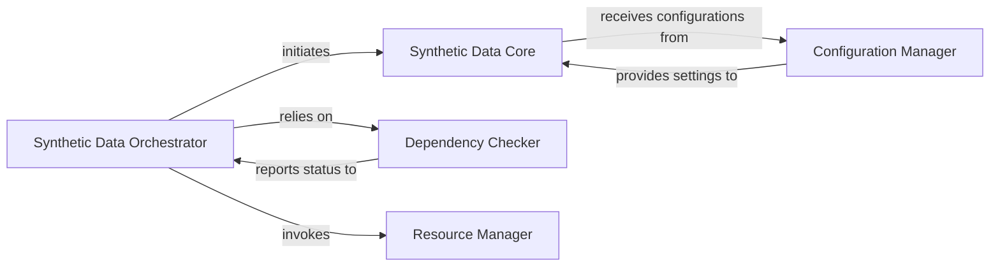

## Details

The Data Preparation & Augmentation subsystem operates as a pipeline orchestrated by the Synthetic Data Orchestrator.

### Synthetic Data Orchestrator
Acts as the primary interface and coordinator for the entire synthetic data generation lifecycle. It manages initialization, resource allocation, and cleanup, orchestrating the flow between other components. This component is central as it defines the overall process flow for data preparation.

**Related Classes/Methods**:

- <a href="https://github.com/unslothai/unsloth/blob/main/unsloth/dataprep/synthetic.py" target="_blank" rel="noopener noreferrer">`unsloth.dataprep.synthetic`</a>

### Synthetic Data Core
Encapsulates the core logic for generating and preparing the synthetic data. This component performs the actual data manipulation, transformation, and creation based on the provided configurations. It is fundamental as it performs the actual data augmentation.

**Related Classes/Methods**:

- <a href="https://github.com/unslothai/unsloth/blob/main/unsloth/dataprep/synthetic.py#L37-L301" target="_blank" rel="noopener noreferrer">`unsloth.dataprep.synthetic.SyntheticDataKit`:37-301</a>

### Configuration Manager
Defines, loads, and manages all parameters and settings necessary for the synthetic data generation process. This includes various configurations that dictate the behavior and output of the data generation. This component is critical for the flexibility and customizability of the data generation process.

**Related Classes/Methods**:

- <a href="https://github.com/unslothai/unsloth/blob/main/unsloth/dataprep/synthetic_configs.py" target="_blank" rel="noopener noreferrer">`unsloth.dataprep.synthetic_configs`</a>

### Dependency Checker
Verifies the presence and status of external dependencies, such as vLLM, which are crucial for the synthetic data generation process. This ensures the operational environment is correctly set up. Essential for ensuring the toolkit's prerequisites are met before data generation.

**Related Classes/Methods**:

- <a href="https://github.com/unslothai/unsloth/blob/main/unsloth/dataprep/synthetic.py#L176-L184" target="_blank" rel="noopener noreferrer">`unsloth.dataprep.synthetic.check_vllm_status`:176-184</a>

### Resource Manager
Handles the proper release and cleanup of computational resources utilized during synthetic data generation. This is critical for preventing memory leaks and ensuring efficient resource utilization, especially in an ML context with large models. This component is vital for performance and stability in an ML toolkit.

**Related Classes/Methods**:

- <a href="https://github.com/unslothai/unsloth/blob/main/unsloth/dataprep/synthetic.py#L187-L216" target="_blank" rel="noopener noreferrer">`unsloth.dataprep.synthetic.cleanup`:187-216</a>

### [FAQ](https://github.com/CodeBoarding/GeneratedOnBoardings/tree/main?tab=readme-ov-file#faq)