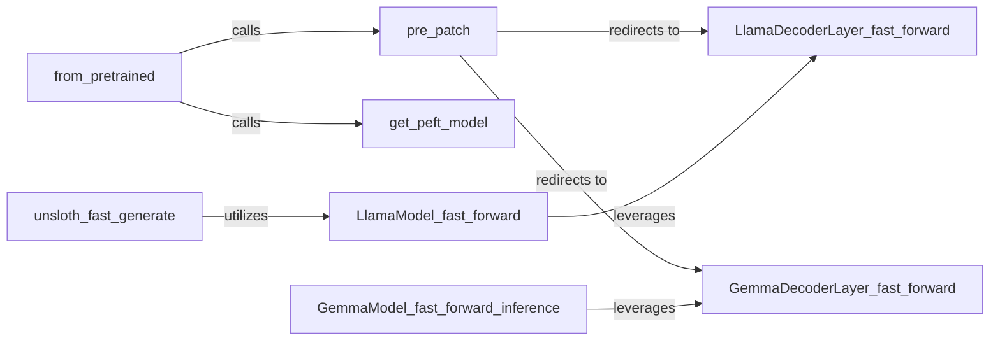

## Details

The Unsloth subsystem provides a streamlined and highly optimized pipeline for fine-tuning and inferencing Hugging Face models. At its core, the `from_pretrained` component acts as the primary user interface, orchestrating the initial model loading, the application of Unsloth's performance patches via `pre_patch`, and the integration of PEFT capabilities through `get_peft_model`. The `pre_patch` component is pivotal, as it dynamically modifies the model's architecture to redirect standard operations to Unsloth's specialized `_fast_forward` implementations (e.g., `LlamaDecoderLayer_fast_forward`, `GemmaDecoderLayer_fast_forward`). These optimized forward passes, which are then leveraged by higher-level model components like `LlamaModel_fast_forward` and `GemmaModel_fast_forward_inference`, are responsible for the significant speedups. The `unsloth_fast_generate` component further extends these optimizations to the text generation process, ensuring efficient and accelerated output. This architecture ensures that Unsloth seamlessly integrates with existing Hugging Face workflows while delivering substantial performance enhancements.

### from_pretrained
Provides a unified, high-level interface for loading and orchestrating the optimization of various Hugging Face models with Unsloth. It acts as the primary entry point for users to load an Unsloth-optimized model.

**Related Classes/Methods**: _None_

### pre_patch
Prepares Hugging Face models for Unsloth's optimizations by applying specific modifications. It acts as the primary mechanism for injecting Unsloth's optimized logic into the standard model architecture, redirecting calls to Unsloth's fast forward implementations.

**Related Classes/Methods**: _None_

### get_peft_model
Integrates Parameter-Efficient Fine-Tuning (PEFT) with the patched models, allowing for efficient fine-tuning of the optimized architectures.

**Related Classes/Methods**: _None_

### LlamaDecoderLayer_fast_forward
An optimized forward pass implementation specifically for the Llama decoder layer, leveraging Unsloth's kernels for performance.

**Related Classes/Methods**: _None_

### LlamaModel_fast_forward
Provides optimized forward and inference passes for the entire Llama model, orchestrating the calls to the optimized decoder layers.

**Related Classes/Methods**: _None_

### GemmaDecoderLayer_fast_forward
An optimized forward pass implementation specifically for the Gemma decoder layer, similar to its Llama counterpart but tailored for Gemma's architecture.

**Related Classes/Methods**: _None_

### GemmaModel_fast_forward_inference
Provides an optimized inference pass for the entire Gemma model, ensuring efficient generation and prediction.

**Related Classes/Methods**: _None_

### unsloth_fast_generate
Provides an optimized text generation pipeline for Llama models, utilizing the underlying fast forward passes for accelerated output.

**Related Classes/Methods**: _None_

### [FAQ](https://github.com/CodeBoarding/GeneratedOnBoardings/tree/main?tab=readme-ov-file#faq)