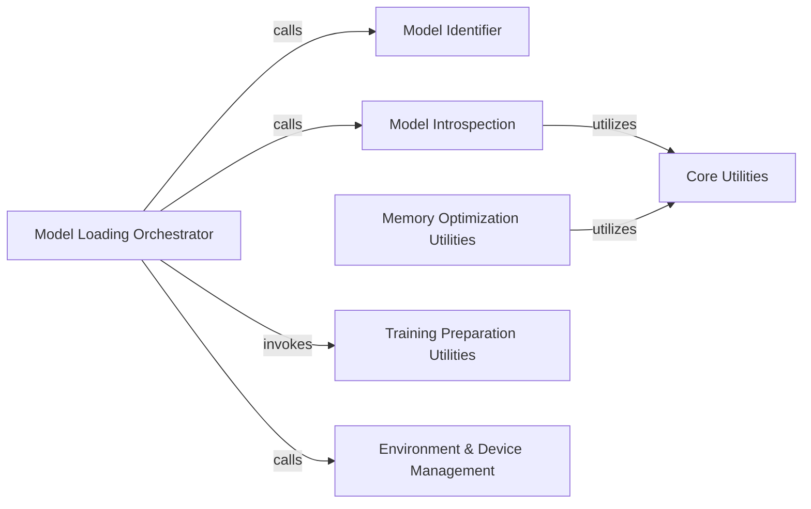

## Details

The `Model Loading & Core Utilities` subsystem is primarily defined by the `unsloth.models.loader` and `unsloth.models._utils` modules. It is responsible for the initial loading, configuration, and foundational optimization of Large Language Models (LLMs) within the Unsloth framework, along with providing essential utilities for model introspection and environment management.

### Model Loading Orchestrator
Acts as the primary entry point (Facade) for loading pre-trained LLM models from external sources like Hugging Face. It orchestrates the entire model preparation pipeline, including model identification, initial configuration, and the application of Unsloth-specific patches and optimizations. This aligns with the "Pipeline" and "Facade" architectural patterns, central to an ML Toolkit.

**Related Classes/Methods**:

- <a href="https://github.com/unslothai/unsloth/blob/main/unsloth/models/loader.py" target="_blank" rel="noopener noreferrer">`unsloth.models.loader`</a>

### Model Identifier
Responsible for accurately determining or extracting the canonical name of the model being loaded. This is a crucial preliminary step for correct model instantiation and subsequent processing within the Unsloth framework.

**Related Classes/Methods**:

- <a href="https://github.com/unslothai/unsloth/blob/main/unsloth/models/loader_utils.py" target="_blank" rel="noopener noreferrer">`unsloth.models.loader_utils`</a>

### Model Introspection
Provides functionalities for querying and analyzing various properties of the loaded model, such as parameter counts, memory usage, and runtime statistics. This information is vital for making informed optimization decisions and debugging, supporting the "Optimization Layer" aspect of Unsloth.

**Related Classes/Methods**:

- <a href="https://github.com/unslothai/unsloth/blob/main/unsloth/models/_utils.py" target="_blank" rel="noopener noreferrer">`unsloth.models._utils`</a>

### Memory Optimization Utilities
Implements advanced memory optimization strategies, particularly focusing on offloading large components like input and output embeddings to disk. This significantly reduces GPU memory footprint, directly addressing Unsloth's core architectural bias towards performance optimization and memory efficiency.

**Related Classes/Methods**:

- <a href="https://github.com/unslothai/unsloth/blob/main/unsloth/models/_utils.py" target="_blank" rel="noopener noreferrer">`unsloth.models._utils`</a>

### Training Preparation Utilities
Applies Unsloth's foundational patches and transformations to models, specifically preparing them for optimized training configurations like k-bit training. This is a critical function within the "Optimization Layer" of the Unsloth architecture.

**Related Classes/Methods**:

- <a href="https://github.com/unslothai/unsloth/blob/main/unsloth/models/_utils.py" target="_blank" rel="noopener noreferrer">`unsloth.models._utils`</a>

### Environment & Device Management
Verifies the system's hardware capabilities (e.g., bfloat16 support, CUDA availability) and checks for the presence of external dependencies (e.g., vLLM). This ensures compatibility and enables the conditional application of specific optimizations, crucial for an ML Toolkit.

**Related Classes/Methods**:

- <a href="https://github.com/unslothai/unsloth/blob/main/unsloth/models/_utils.py" target="_blank" rel="noopener noreferrer">`unsloth.models._utils`</a>

### Core Utilities [[Expand]](./Core_Utilities.md)
Provides a collection of general-purpose helper functions used across the `Model Loading & Core Utilities` subsystem. These include basic file operations, data manipulation (e.g., creating boolean masks), and internal error handling mechanisms.

**Related Classes/Methods**:

- <a href="https://github.com/unslothai/unsloth/blob/main/unsloth/models/_utils.py" target="_blank" rel="noopener noreferrer">`unsloth.models._utils`</a>

### [FAQ](https://github.com/CodeBoarding/GeneratedOnBoardings/tree/main?tab=readme-ov-file#faq)