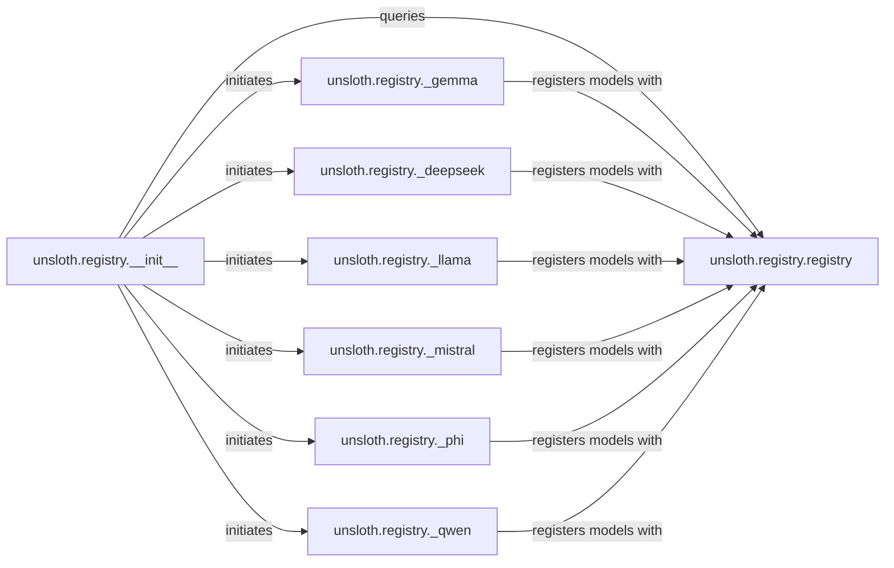

## Details

The `Model Registry` subsystem is a critical part of Unsloth, providing a centralized and extensible mechanism for managing supported LLMs and their configurations.

### unsloth.registry.registry
This is the core data store and logic hub for all registered Unsloth models. It maintains the internal collection of models, standardizes model names (e.g., by appending quantization types or instruction tags), and provides the fundamental `register_model` mechanism to add models to the registry, ensuring consistency and uniqueness.

**Related Classes/Methods**:

- <a href="https://github.com/unslothai/unsloth/blob/main/unsloth/registry/registry.py" target="_blank" rel="noopener noreferrer">`unsloth.registry.registry`</a>

### unsloth.registry.__init__
This module serves as the primary public entry point for external components to interact with the model registry. Its `search_models` function is the main API for querying available models. Crucially, it orchestrates the initial model registration process by implicitly triggering the loading and execution of the specific model registrar modules to populate the central registry.

**Related Classes/Methods**:

- <a href="https://github.com/unslothai/unsloth/blob/main/unsloth/registry/__init__.py" target="_blank" rel="noopener noreferrer">`unsloth.registry.__init__`</a>

### unsloth.registry._gemma
This module is dedicated to defining and registering specific variants (e.g., base, instruct, different quantization types) of the Gemma model family. It encapsulates the unique configuration details and registration logic for its respective models, ensuring that all supported versions are correctly added to the central registry.

**Related Classes/Methods**:

- <a href="https://github.com/unslothai/unsloth/blob/main/unsloth/registry/_gemma.py" target="_blank" rel="noopener noreferrer">`unsloth.registry._gemma`</a>

### unsloth.registry._deepseek
This module is dedicated to defining and registering specific variants (e.g., base, instruct, different quantization types) of the Deepseek model family. It encapsulates the unique configuration details and registration logic for its respective models, ensuring that all supported versions are correctly added to the central registry.

**Related Classes/Methods**:

- <a href="https://github.com/unslothai/unsloth/blob/main/unsloth/registry/_deepseek.py" target="_blank" rel="noopener noreferrer">`unsloth.registry._deepseek`</a>

### unsloth.registry._llama
This module is dedicated to defining and registering specific variants (e.g., base, instruct, different quantization types) of the Llama model family. It encapsulates the unique configuration details and registration logic for its respective models, ensuring that all supported versions are correctly added to the central registry.

**Related Classes/Methods**:

- <a href="https://github.com/unslothai/unsloth/blob/main/unsloth/registry/_llama.py" target="_blank" rel="noopener noreferrer">`unsloth.registry._llama`</a>

### unsloth.registry._mistral
This module is dedicated to defining and registering specific variants (e.g., base, instruct, different quantization types) of the Mistral model family. It encapsulates the unique configuration details and registration logic for its respective models, ensuring that all supported versions are correctly added to the central registry.

**Related Classes/Methods**:

- <a href="https://github.com/unslothai/unsloth/blob/main/unsloth/registry/_mistral.py" target="_blank" rel="noopener noreferrer">`unsloth.registry._mistral`</a>

### unsloth.registry._phi
This module is dedicated to defining and registering specific variants (e.g., base, instruct, different quantization types) of the Phi model family. It encapsulates the unique configuration details and registration logic for its respective models, ensuring that all supported versions are correctly added to the central registry.

**Related Classes/Methods**:

- <a href="https://github.com/unslothai/unsloth/blob/main/unsloth/registry/_phi.py" target="_blank" rel="noopener noreferrer">`unsloth.registry._phi`</a>

### unsloth.registry._qwen
This module is dedicated to defining and registering specific variants (e.g., base, instruct, different quantization types) of the Qwen model family. It encapsulates the unique configuration details and registration logic for its respective models, ensuring that all supported versions are correctly added to the central registry.

**Related Classes/Methods**:

- <a href="https://github.com/unslothai/unsloth/blob/main/unsloth/registry/_qwen.py" target="_blank" rel="noopener noreferrer">`unsloth.registry._qwen`</a>

### [FAQ](https://github.com/CodeBoarding/GeneratedOnBoardings/tree/main?tab=readme-ov-file#faq)