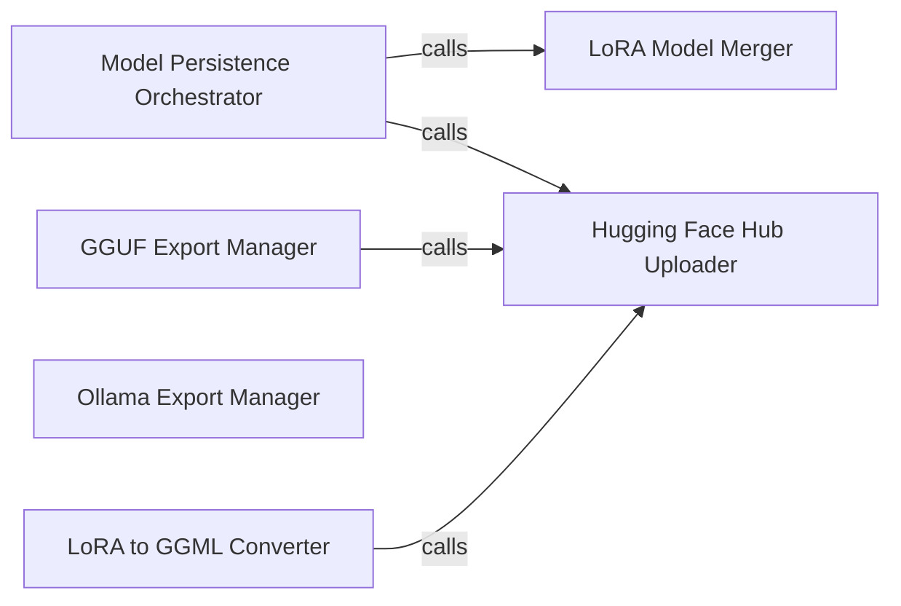

## Details

The `unsloth.save` subsystem is primarily responsible for persisting fine-tuned models in various formats and facilitating their distribution. The `Model Persistence Orchestrator` acts as the central facade, simplifying the complex process of saving models by coordinating with specialized components. It delegates the merging of LoRA adapters to the `LoRA Model Merger` and handles the general uploading of models to the Hugging Face Hub via the `Hugging Face Hub Uploader`. Specialized export managers, such as the `GGUF Export Manager` and `Ollama Export Manager`, handle format-specific conversions and deployments. The `LoRA to GGML Converter` is a further specialized component for converting LoRA adapters to the GGML format, often as a precursor to GGUF. The `Hugging Face Hub Uploader` serves as a common integration point for all components that need to push artifacts to the Hugging Face platform. This architecture promotes modularity and allows for the independent evolution of different saving and export functionalities.

### Model Persistence Orchestrator
Serves as the high-level entry point for saving fine-tuned models. It orchestrates the overall saving process, potentially involving LoRA adapter merging and general model persistence, offering a simplified interface to the user. This component embodies the Facade pattern, abstracting complex saving workflows.

**Related Classes/Methods**:

- <a href="https://github.com/unslothai/unsloth/blob/main/unsloth/save.py#L203-L758" target="_blank" rel="noopener noreferrer">`unsloth.save.unsloth_save_model`:203-758</a>

### LoRA Model Merger
Dedicated to integrating LoRA (Low-Rank Adaptation) adapters into the base model. This is a critical step for preparing a fine-tuned model for full saving or conversion, ensuring the learned adaptations are permanently applied. This component is key to the Optimization Layer aspect of Unsloth.

**Related Classes/Methods**:

- <a href="https://github.com/unslothai/unsloth/blob/main/unsloth/save.py#L158-L185" target="_blank" rel="noopener noreferrer">`unsloth.save._merge_lora`:158-185</a>

### GGUF Export Manager
Manages the specialized process of converting and saving models into the GGUF format, which is highly optimized for CPU inference and widely used for local LLM deployment. It handles both local saving and pushing to the Hugging Face Hub. This component represents a specialized Model Export capability.

**Related Classes/Methods**:

- <a href="https://github.com/unslothai/unsloth/blob/main/unsloth/save.py#L951-L1281" target="_blank" rel="noopener noreferrer">`unsloth.save.save_to_gguf`:951-1281</a>
- <a href="https://github.com/unslothai/unsloth/blob/main/unsloth/save.py#L1734-L1913" target="_blank" rel="noopener noreferrer">`unsloth.save.unsloth_save_pretrained_gguf`:1734-1913</a>
- <a href="https://github.com/unslothai/unsloth/blob/main/unsloth/save.py#L1917-L2089" target="_blank" rel="noopener noreferrer">`unsloth.save.unsloth_push_to_hub_gguf`:1917-2089</a>

### Ollama Export Manager
Handles the specific workflow for preparing and deploying models to the Ollama platform, a popular tool for running LLMs locally. This involves packaging the model in a format compatible with Ollama's requirements. This component is part of the Integration Layer.

**Related Classes/Methods**:

- <a href="https://github.com/unslothai/unsloth/blob/main/unsloth/save.py#L1699-L1728" target="_blank" rel="noopener noreferrer">`unsloth.save.push_to_ollama`:1699-1728</a>

### Hugging Face Hub Uploader
Provides a generic and reusable mechanism for uploading models or model artifacts to the Hugging Face Model Hub. It serves as a common integration point for sharing and distributing models across various export paths. This component is a key part of the Integration Layer.

**Related Classes/Methods**:

- <a href="https://github.com/unslothai/unsloth/blob/main/unsloth/save.py#L1459-L1546" target="_blank" rel="noopener noreferrer">`unsloth.save.upload_to_huggingface`:1459-1546</a>

### LoRA to GGML Converter
Manages the specific conversion process of LoRA adapters to the GGML format, which is often a precursor to GGUF conversion. It supports both local saving and pushing the converted LoRA adapters to a hub. This is a specialized Model Export sub-component.

**Related Classes/Methods**:

- <a href="https://github.com/unslothai/unsloth/blob/main/unsloth/save.py#L2107-L2173" target="_blank" rel="noopener noreferrer">`unsloth.save.unsloth_convert_lora_to_ggml_and_push_to_hub`:2107-2173</a>
- <a href="https://github.com/unslothai/unsloth/blob/main/unsloth/save.py#L2175-L2225" target="_blank" rel="noopener noreferrer">`unsloth.save.unsloth_convert_lora_to_ggml_and_save_locally`:2175-2225</a>

### [FAQ](https://github.com/CodeBoarding/GeneratedOnBoardings/tree/main?tab=readme-ov-file#faq)