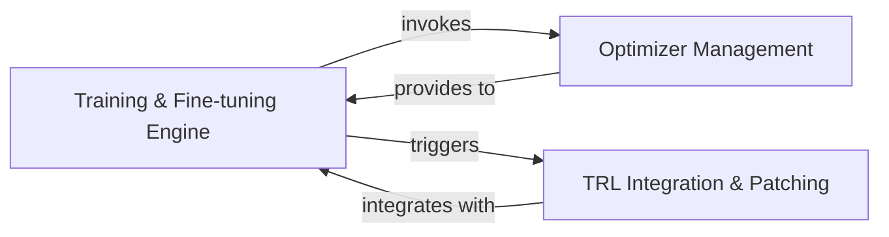

## Details

The `Training & Fine-tuning Engine` subsystem is a critical part of Unsloth, focusing on optimizing the fine-tuning process for Large Language Models (LLMs). It embodies the project's architectural bias towards performance and memory efficiency.

### Training & Fine-tuning Engine [[Expand]](./Training_Fine_tuning_Engine.md)
This is the orchestrating component for LLM fine-tuning within Unsloth. It provides the overarching capabilities for configuring optimizers and integrating with external training frameworks (e.g., Hugging Face TRL) to ensure highly efficient and memory-optimized fine-tuning of LLMs. It acts as a facade for the underlying optimization mechanisms.

**Related Classes/Methods**:

- <a href="https://github.com/unslothai/unsloth/blob/main/unsloth/trainer.py" target="_blank" rel="noopener noreferrer">`unsloth/trainer.py`</a>
- <a href="https://github.com/unslothai/unsloth/blob/main/unsloth/models/rl.py" target="_blank" rel="noopener noreferrer">`unsloth/models/rl.py`</a>

### Optimizer Management
Responsible for the generation and configuration of highly optimized optimizers specifically tailored for Unsloth's performance requirements. It encapsulates the logic for creating specialized optimizers that significantly enhance the training efficiency of LLMs, often by leveraging custom kernels or configurations.

**Related Classes/Methods**:

- <a href="https://github.com/unslothai/unsloth/blob/main/unsloth/trainer.py" target="_blank" rel="noopener noreferrer">`unsloth/trainer.py:create_optimizer`</a>
- <a href="https://github.com/unslothai/unsloth/blob/main/unsloth/trainer.py" target="_blank" rel="noopener noreferrer">`unsloth/trainer.py:_create_unsloth_optimizer`</a>

### TRL Integration & Patching
Focuses on seamlessly integrating Unsloth's performance optimizations directly into Hugging Face's Transformer Reinforcement Learning (TRL) trainers. It achieves this by applying specific patches to TRL's internal mechanisms, ensuring that Unsloth's enhancements are active during RL fine-tuning. It also provides different patching strategies (e.g., PatchFastRL, PatchRL).

**Related Classes/Methods**:

- <a href="https://github.com/unslothai/unsloth/blob/main/unsloth/models/rl.py" target="_blank" rel="noopener noreferrer">`unsloth/models/rl.py:_patch_trl_rl_trainers`</a>
- <a href="https://github.com/unslothai/unsloth/blob/main/unsloth/models/rl.py" target="_blank" rel="noopener noreferrer">`unsloth/models/rl.py:patch_trl_rl_trainers`</a>
- <a href="https://github.com/unslothai/unsloth/blob/main/unsloth/models/rl.py" target="_blank" rel="noopener noreferrer">`unsloth/models/rl.py:PatchFastRL`</a>
- <a href="https://github.com/unslothai/unsloth/blob/main/unsloth/models/rl.py" target="_blank" rel="noopener noreferrer">`unsloth/models/rl.py:PatchRL`</a>

### [FAQ](https://github.com/CodeBoarding/GeneratedOnBoardings/tree/main?tab=readme-ov-file#faq)