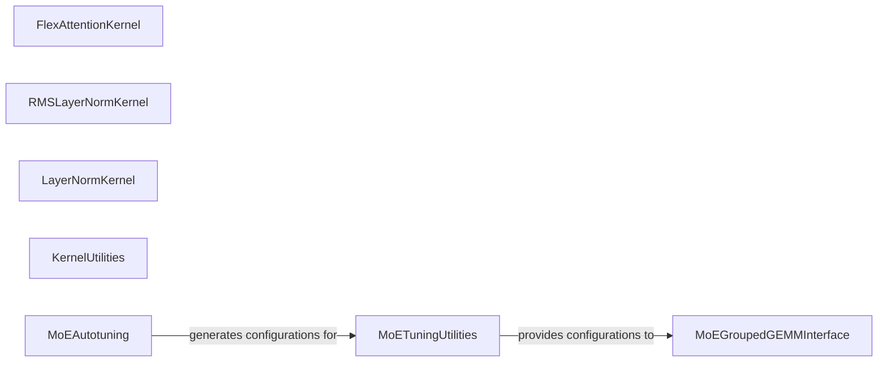

## Details

The Unsloth Optimization Layer (Kernels) subsystem is the core performance engine of Unsloth, comprising highly optimized CUDA kernels for fundamental neural network operations. Its boundaries are defined by the unsloth.kernels Python package.

### FlexAttentionKernel
Provides highly optimized CUDA kernels for various attention mechanisms, including causal and sliding window masks, and softcapping. It directly implements the performance-critical attention operation.

**Related Classes/Methods**:

- <a href="https://github.com/unslothai/unsloth/blob/main/unsloth/kernels/flex_attention.py#L1-L1000" target="_blank" rel="noopener noreferrer">`unsloth.kernels.flex_attention`:1-1000</a>

### RMSLayerNormKernel
Implements fast RMS Layer Normalization using specialized optimized kernels, crucial for efficient model training and inference.

**Related Classes/Methods**:

- <a href="https://github.com/unslothai/unsloth/blob/main/unsloth/kernels/rms_layernorm.py#L1-L1000" target="_blank" rel="noopener noreferrer">`unsloth.kernels.rms_layernorm`:1-1000</a>

### LayerNormKernel
Provides fast standard Layer Normalization through optimized kernels, similar to RMS Layer Normalization but for general layer normalization.

**Related Classes/Methods**:

- <a href="https://github.com/unslothai/unsloth/blob/main/unsloth/kernels/layernorm.py#L1-L1000" target="_blank" rel="noopener noreferrer">`unsloth.kernels.layernorm`:1-1000</a>

### KernelUtilities
Offers fundamental utility functions for performance-critical operations such as fast dequantization, General Matrix-Vector multiplication (GEMV), and optimized linear forward passes, particularly for LoRA (Low-Rank Adaptation) operations. It serves as a collection of low-level, highly optimized primitives.

**Related Classes/Methods**:

- <a href="https://github.com/unslothai/unsloth/blob/main/unsloth/kernels/utils.py#L1-L1000" target="_blank" rel="noopener noreferrer">`unsloth.kernels.utils`:1-1000</a>

### MoEGroupedGEMMInterface
Serves as the high-level interface (Facade) for grouped General Matrix Multiplication (GEMM) operations, specifically designed for Mixture of Experts (MoE) layers. It manages the forward and backward passes, abstracting the complexity of the underlying MoE kernels.

**Related Classes/Methods**:

- <a href="https://github.com/unslothai/unsloth/blob/main/unsloth/kernels/moe/grouped_gemm/interface.py#L1-L1000" target="_blank" rel="noopener noreferrer">`unsloth.kernels.moe.grouped_gemm.interface`:1-1000</a>

### MoEAutotuning
Manages the autotuning process for MoE grouped GEMM kernels. This includes generating various kernel configurations and pruning them based on criteria such as shared memory capacity, ensuring optimal performance for MoE operations.

**Related Classes/Methods**:

- <a href="https://github.com/unslothai/unsloth/blob/main/unsloth/kernels/moe/grouped_gemm/kernels/autotuning.py#L1-L1000" target="_blank" rel="noopener noreferrer">`unsloth.kernels.moe.grouped_gemm.kernels.autotuning`:1-1000</a>

### MoETuningUtilities
Provides utilities for managing, retrieving, and presenting kernel configurations, particularly for MoE operations. It supports data representation (e.g., converting to DataFrame for CSV or table printing), acting as a configuration management layer for tuned kernels.

**Related Classes/Methods**:

- <a href="https://github.com/unslothai/unsloth/blob/main/unsloth/kernels/moe/grouped_gemm/kernels/tuning.py#L1-L1000" target="_blank" rel="noopener noreferrer">`unsloth.kernels.moe.grouped_gemm.kernels.tuning`:1-1000</a>

### [FAQ](https://github.com/CodeBoarding/GeneratedOnBoardings/tree/main?tab=readme-ov-file#faq)