```mermaid
graph LR
    Model_Loading_Core_Utilities["Model Loading & Core Utilities"]
    Tokenizer_Chat_Template_Management["Tokenizer & Chat Template Management"]
    Unsloth_Optimization_Layer_Kernels_["Unsloth Optimization Layer (Kernels)"]
    Model_Architecture_Adapters["Model Architecture Adapters"]
    Training_Fine_tuning_Engine["Training & Fine-tuning Engine"]
    Model_Saving_Export["Model Saving & Export"]
    Model_Registry["Model Registry"]
    Data_Preparation_Augmentation["Data Preparation & Augmentation"]
    Model_Registry -- "provides metadata to" --> Model_Loading_Core_Utilities
    Model_Loading_Core_Utilities -- "passes loaded and initially patched models to" --> Model_Architecture_Adapters
    Data_Preparation_Augmentation -- "supplies raw data for processing to" --> Tokenizer_Chat_Template_Management
    Tokenizer_Chat_Template_Management -- "provides formatted and tokenized input data to" --> Model_Architecture_Adapters
    Model_Architecture_Adapters -- "invokes and utilizes optimized kernel operations from" --> Unsloth_Optimization_Layer_Kernels_
    Unsloth_Optimization_Layer_Kernels_ -- "returns results of accelerated computations to" --> Model_Architecture_Adapters
    Model_Architecture_Adapters -- "provides the model for training and receives parameter updates from" --> Training_Fine_tuning_Engine
    Model_Architecture_Adapters -- "passes the final model state for persistence to" --> Model_Saving_Export
    Unsloth_Optimization_Layer_Kernels_ -- "informs the export process, especially for quantization and format-specific optimizations to" --> Model_Saving_Export
    click Model_Loading_Core_Utilities href "https://github.com/CodeBoarding/GeneratedOnBoardings/blob/main/unsloth/Model_Loading_Core_Utilities.md" "Details"
    click Unsloth_Optimization_Layer_Kernels_ href "https://github.com/CodeBoarding/GeneratedOnBoardings/blob/main/unsloth/Unsloth_Optimization_Layer_Kernels_.md" "Details"
    click Model_Architecture_Adapters href "https://github.com/CodeBoarding/GeneratedOnBoardings/blob/main/unsloth/Model_Architecture_Adapters.md" "Details"
    click Training_Fine_tuning_Engine href "https://github.com/CodeBoarding/GeneratedOnBoardings/blob/main/unsloth/Training_Fine_tuning_Engine.md" "Details"
    click Model_Saving_Export href "https://github.com/CodeBoarding/GeneratedOnBoardings/blob/main/unsloth/Model_Saving_Export.md" "Details"
    click Model_Registry href "https://github.com/CodeBoarding/GeneratedOnBoardings/blob/main/unsloth/Model_Registry.md" "Details"
    click Data_Preparation_Augmentation href "https://github.com/CodeBoarding/GeneratedOnBoardings/blob/main/unsloth/Data_Preparation_Augmentation.md" "Details"
```

## Details

Unsloth's architecture is designed for efficient fine-tuning and deployment of large language models. It centers around a highly optimized kernel layer that accelerates core neural network operations. The system integrates seamlessly with Hugging Face models, providing specialized adapters that leverage Unsloth's optimizations. Data flows from preparation and tokenization into the adapted models for training, with a robust saving and export mechanism for deployment. A central model registry ensures discoverability and configuration management for supported models.

### Model Loading & Core Utilities [[Expand]](./Model_Loading_Core_Utilities.md)
Manages the initial loading of base LLM models from sources like Hugging Face, applies foundational Unsloth patches, and provides general utilities for model introspection and device management.

**Related Classes/Methods**:

- <a href="https://github.com/unslothai/unsloth/blob/main/unsloth/models/loader.py" target="_blank" rel="noopener noreferrer">`unsloth.models.loader`</a>
- <a href="https://github.com/unslothai/unsloth/blob/main/unsloth/models/_utils.py" target="_blank" rel="noopener noreferrer">`unsloth.models._utils`</a>

### Tokenizer & Chat Template Management
Handles the efficient loading, conversion, and fixing of tokenizers, and provides utilities for applying structured chat templates to input data.

**Related Classes/Methods**:

- <a href="https://github.com/unslothai/unsloth/blob/main/unsloth/tokenizer_utils.py" target="_blank" rel="noopener noreferrer">`unsloth.tokenizer_utils`</a>
- <a href="https://github.com/unslothai/unsloth/blob/main/unsloth/chat_templates.py" target="_blank" rel="noopener noreferrer">`unsloth.chat_templates`</a>

### Unsloth Optimization Layer (Kernels) [[Expand]](./Unsloth_Optimization_Layer_Kernels_.md)
The core performance engine of Unsloth, comprising highly optimized CUDA kernels for fundamental neural network operations (attention, normalization, linear transformations, MoE).

**Related Classes/Methods**:

- <a href="https://github.com/unslothai/unsloth/blob/main/unsloth/kernels/flex_attention.py" target="_blank" rel="noopener noreferrer">`unsloth.kernels.flex_attention`</a>
- <a href="https://github.com/unslothai/unsloth/blob/main/unsloth/kernels/rms_layernorm.py" target="_blank" rel="noopener noreferrer">`unsloth.kernels.rms_layernorm`</a>
- <a href="https://github.com/unslothai/unsloth/blob/main/unsloth/kernels/moe/grouped_gemm/interface.py" target="_blank" rel="noopener noreferrer">`unsloth.kernels.moe.grouped_gemm.interface`</a>
- <a href="https://github.com/unslothai/unsloth/blob/main/unsloth/kernels/utils.py" target="_blank" rel="noopener noreferrer">`unsloth.kernels.utils`</a>

### Model Architecture Adapters [[Expand]](./Model_Architecture_Adapters.md)
Contains Unsloth's specialized, patched implementations of various popular LLM architectures (e.g., Llama, Gemma, Qwen, Mistral). These adapters override standard Hugging Face modules to integrate and leverage the Unsloth Optimization Layer (Kernels).

**Related Classes/Methods**:

- <a href="https://github.com/unslothai/unsloth/blob/main/unsloth/models/llama.py" target="_blank" rel="noopener noreferrer">`unsloth.models.llama`</a>
- <a href="https://github.com/unslothai/unsloth/blob/main/unsloth/models/gemma.py" target="_blank" rel="noopener noreferrer">`unsloth.models.gemma`</a>
- <a href="https://github.com/unslothai/unsloth/blob/main/unsloth/models/qwen3.py" target="_blank" rel="noopener noreferrer">`unsloth.models.qwen3`</a>

### Training & Fine-tuning Engine [[Expand]](./Training_Fine_tuning_Engine.md)
Provides utilities for configuring optimizers and integrates with training frameworks (e.g., Hugging Face TRL) to enable efficient fine-tuning of LLMs.

**Related Classes/Methods**:

- <a href="https://github.com/unslothai/unsloth/blob/main/unsloth/trainer.py" target="_blank" rel="noopener noreferrer">`unsloth.trainer`</a>
- <a href="https://github.com/unslothai/unsloth/blob/main/unsloth/models/rl.py" target="_blank" rel="noopener noreferrer">`unsloth.models.rl`</a>

### Model Saving & Export [[Expand]](./Model_Saving_Export.md)
Manages the persistence of fine-tuned models, including merging LoRA adapters into the base model, and exporting models into various deployment-friendly formats like GGUF and Ollama.

**Related Classes/Methods**:

- <a href="https://github.com/unslothai/unsloth/blob/main/unsloth/save.py" target="_blank" rel="noopener noreferrer">`unsloth.save`</a>

### Model Registry [[Expand]](./Model_Registry.md)
A centralized system for registering and searching for supported Unsloth models, including their quantization types and specific configurations.

**Related Classes/Methods**:

- <a href="https://github.com/unslothai/unsloth/blob/main/unsloth/registry/registry.py" target="_blank" rel="noopener noreferrer">`unsloth.registry.registry`</a>
- <a href="https://github.com/unslothai/unsloth/blob/main/unsloth/registry" target="_blank" rel="noopener noreferrer">`unsloth.registry`</a>

### Data Preparation & Augmentation [[Expand]](./Data_Preparation_Augmentation.md)
Handles the generation and preparation of synthetic datasets, including configuration and processing, to feed into the training pipeline for efficient text processing.

**Related Classes/Methods**:

- <a href="https://github.com/unslothai/unsloth/blob/main/unsloth/dataprep/synthetic.py" target="_blank" rel="noopener noreferrer">`unsloth.dataprep.synthetic`</a>
- <a href="https://github.com/unslothai/unsloth/blob/main/unsloth/dataprep/synthetic_configs.py" target="_blank" rel="noopener noreferrer">`unsloth.dataprep.synthetic_configs`</a>

### [FAQ](https://github.com/CodeBoarding/GeneratedOnBoardings/tree/main?tab=readme-ov-file#faq)