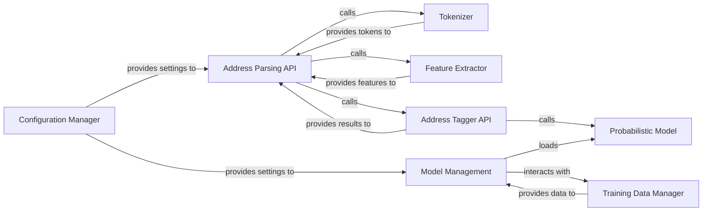

## Details

The `usaddress` library's architecture is designed for robust address parsing. The `Address Parsing API` serves as the central entry point, orchestrating the entire process. It first utilizes the `Tokenizer` to break down raw address strings into individual tokens. These tokens are then processed by the `Feature Extractor` to generate a rich set of features. The `Address Tagger API` then takes these features and interacts with the `Probabilistic Model` (a CRF model) to assign specific address component tags to each token. `Model Management` handles the loading and lifecycle of the `Probabilistic Model`, relying on the `Training Data Manager` for labeled data and the `Configuration Manager` for operational settings. This modular design ensures a clear separation of concerns, facilitating maintainability and future enhancements.

### Address Parsing API [[Expand]](./Address_Parsing_API.md)
The primary public interface and orchestrator of the `usaddress` library. It receives raw address strings, coordinates the entire parsing workflow (including tokenization, feature extraction, and subsequent tagging), and returns structured address data. This component embodies both the "Input/Output Interface" and the "Parsing Engine Orchestrator" concepts.

**Related Classes/Methods**:

- <a href="https://github.com/datamade/usaddress/blob/main/usaddress/__init__.py#L671-L680" target="_blank" rel="noopener noreferrer">`usaddress.parse`:671-680</a>

### Tokenizer
Responsible for breaking down raw input address strings into individual tokens (e.g., words, numbers, punctuation). This is the first step in the parsing pipeline, preparing the input for feature extraction.

**Related Classes/Methods**:

### Feature Extractor
Transforms the tokens generated by the `Tokenizer` into a rich set of features (e.g., word shape, capitalization, contextual information) that the `Probabilistic Model` can effectively use for accurate address component tagging.

**Related Classes/Methods**:

- <a href="https://github.com/datamade/usaddress/blob/main/usaddress/__init__.py#L300-L400" target="_blank" rel="noopener noreferrer">`usaddress.token_features`:300-400</a>

### Probabilistic Model
The central "Probabilistic Model" component, likely implemented using `python-crfsuite`. It applies a trained Conditional Random Field (CRF) model to the extracted features, assigning specific address component tags (e.g., `StreetName`, `City`, `State`) to each token. This is the core intelligence of the parsing process.

**Related Classes/Methods**:

### Address Tagger API
A specialized interface or internal component focused directly on the tagging process. It takes prepared features and interacts with the `Probabilistic Model` to perform the actual tagging of address components. It can be called by the `Address Parsing API` or potentially used for more granular control.

**Related Classes/Methods**:

- <a href="https://github.com/datamade/usaddress/blob/main/usaddress/__init__.py#L600-L650" target="_blank" rel="noopener noreferrer">`usaddress.tag`:600-650</a>

### Model Management
Responsible for loading, saving, and managing the lifecycle of the `Probabilistic Model`. This component ensures that the correct and most up-to-date model is available for the parsing and tagging operations, and facilitates model training and updates.

**Related Classes/Methods**:

- <a href="https://github.com/datamade/usaddress/blob/main/usaddress/__init__.py#L46-L47" target="_blank" rel="noopener noreferrer">`usaddress.MODEL_PATH`:46-47</a>

### Training Data Manager
Manages the collection, preparation, and loading of the labeled training data used to train and improve the `Probabilistic Model`. This component is fundamental to the "Data-Driven" aspect of the library, enabling continuous model improvement.

**Related Classes/Methods**:

- <a href="https://github.com/datamade/usaddress/blob/main/usaddress/__init__.py#L14-L41" target="_blank" rel="noopener noreferrer">`usaddress.LABELS`:14-41</a>

### Configuration Manager
Handles the loading and management of various configuration settings for the entire library, such as paths to model files, default parsing behaviors, and other operational parameters. It ensures the library operates according to specified settings.

**Related Classes/Methods**:

- <a href="https://github.com/datamade/usaddress/blob/main/usaddress/__init__.py#L46-L47" target="_blank" rel="noopener noreferrer">`usaddress.MODEL_FILE`:46-47</a>

### [FAQ](https://github.com/CodeBoarding/GeneratedOnBoardings/tree/main?tab=readme-ov-file#faq)