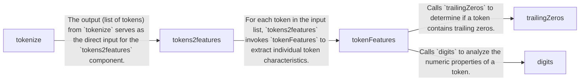

## Details

The `usaddress` library's core functionality for parsing address strings is centered around a pipeline that transforms raw input into structured, tagged address components. This process begins with the `tokenize` component, which breaks down the address string into individual tokens. These tokens are then fed into the `tokens2features` component, responsible for generating a rich set of features for each token, leveraging the `tokenFeatures` component. The `tokenFeatures` component, in turn, utilizes helper functions like `digits` and `trailingZeros` to extract specific numeric and pattern-based characteristics. This feature engineering prepares the data for a probabilistic model, enabling accurate classification and structuring of address elements.

### tokenize
This component is responsible for the initial transformation of a raw, unstructured address string into a list of discrete, ordered tokens. It acts as the entry point for the pre-processing pipeline, breaking down the input into manageable units using regular expressions.

**Related Classes/Methods**:

- <a href="https://github.com/datamade/usaddress/blob/main/usaddress/__init__.py#L731-L749" target="_blank" rel="noopener noreferrer">`tokenize`:731-749</a>

### tokens2features
This component takes the list of tokens generated by `tokenize` and transforms them into a comprehensive feature set. It orchestrates the feature extraction process for the entire sequence of tokens, preparing the data for the probabilistic model by adding 'previous' and 'next' token features.

**Related Classes/Methods**:

- <a href="https://github.com/datamade/usaddress/blob/main/usaddress/__init__.py#L785-L807" target="_blank" rel="noopener noreferrer">`tokens2features`:785-807</a>

### tokenFeatures
This component is responsible for analyzing a single token and extracting a rich set of features relevant for address parsing. These features capture various characteristics such as capitalization, numeric properties, and specific patterns, which are crucial for the probabilistic model's classification.

**Related Classes/Methods**:

- <a href="https://github.com/datamade/usaddress/blob/main/usaddress/__init__.py#L755-L782" target="_blank" rel="noopener noreferrer">`tokenFeatures`:755-782</a>

### trailingZeros
A utility component that checks if a given token (specifically a numeric one) contains trailing zeros. This specific feature can be important for distinguishing certain address components (e.g., "100" vs. "10").

**Related Classes/Methods**:

- <a href="https://github.com/datamade/usaddress/blob/main/usaddress/__init__.py#L820-L825" target="_blank" rel="noopener noreferrer">`trailingZeros`:820-825</a>

### digits
A utility component that analyzes the numeric composition of a token, identifying if it contains digits and potentially other numeric-related characteristics. This helps in classifying tokens as numbers, postal codes, or other numeric address elements.

**Related Classes/Methods**:

- <a href="https://github.com/datamade/usaddress/blob/main/usaddress/__init__.py#L810-L816" target="_blank" rel="noopener noreferrer">`digits`:810-816</a>

### [FAQ](https://github.com/CodeBoarding/GeneratedOnBoardings/tree/main?tab=readme-ov-file#faq)