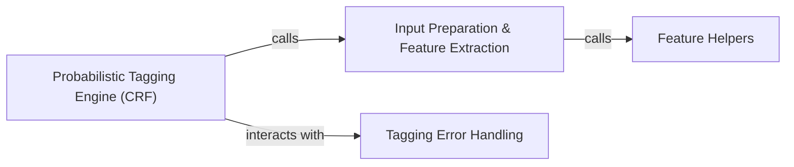

## Details

The `Probabilistic Tagging Engine (CRF)` subsystem is a core part of the `usaddress` library, responsible for applying the trained Conditional Random Field (CRF) model to parse and tag address strings.

### Probabilistic Tagging Engine (CRF) [[Expand]](./Probabilistic_Tagging_Engine_CRF_.md)
This is the primary operational interface to the trained CRF model. It orchestrates the entire address tagging workflow, directing input through feature extraction and applying the CRF model's learned patterns to predict and assign address component labels. It also manages specific error conditions, such as `RepeatedLabelError`.

**Related Classes/Methods**:

- <a href="https://github.com/datamade/usaddress/blob/main/usaddress/__init__.py#L683-L728" target="_blank" rel="noopener noreferrer">`tag`:683-728</a>

### Input Preparation & Feature Extraction
This component is responsible for transforming a raw input address string into a sequence of tokens and then extracting a rich set of features from these tokens. These features are crucial for the CRF model's ability to make accurate predictions.

**Related Classes/Methods**:

- <a href="https://github.com/datamade/usaddress/blob/main/usaddress/__init__.py#L671-L680" target="_blank" rel="noopener noreferrer">`parse`:671-680</a>
- <a href="https://github.com/datamade/usaddress/blob/main/usaddress/__init__.py#L785-L807" target="_blank" rel="noopener noreferrer">`tokens2features`:785-807</a>
- <a href="https://github.com/datamade/usaddress/blob/main/usaddress/__init__.py#L755-L782" target="_blank" rel="noopener noreferrer">`tokenFeatures`:755-782</a>
- <a href="https://github.com/datamade/usaddress/blob/main/usaddress/__init__.py#L731-L749" target="_blank" rel="noopener noreferrer">`tokenize`:731-749</a>

### Feature Helpers
Provides specific utility functions to extract granular features (e.g., presence of trailing zeros, digits) from individual tokens. These granular features are then aggregated by the `Input Preparation & Feature Extraction` component to build the complete feature set for the CRF model.

**Related Classes/Methods**:

- <a href="https://github.com/datamade/usaddress/blob/main/usaddress/__init__.py#L820-L825" target="_blank" rel="noopener noreferrer">`trailingZeros`:820-825</a>
- <a href="https://github.com/datamade/usaddress/blob/main/usaddress/__init__.py#L810-L816" target="_blank" rel="noopener noreferrer">`digits`:810-816</a>

### Tagging Error Handling
Defines and manages specific error conditions, such as `RepeatedLabelError`, that occur when repeated labels are detected in the output of the tagging process. This indicates potential issues with the model's predictions or the input data, allowing the system to respond appropriately.

**Related Classes/Methods**:

- <a href="https://github.com/datamade/usaddress/blob/main/usaddress/__init__.py#L828-L830" target="_blank" rel="noopener noreferrer">`RepeatedLabelError`:828-830</a>

### [FAQ](https://github.com/CodeBoarding/GeneratedOnBoardings/tree/main?tab=readme-ov-file#faq)