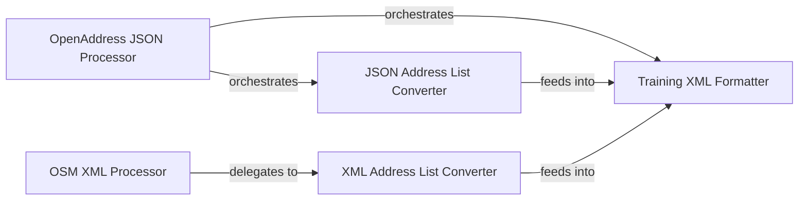

## Details

The Training Data Processors subsystem is responsible for the offline ingestion and conversion of raw data sources into the specific XML format required for training or retraining the Probabilistic Tagging Engine (CRF). This subsystem is critical for ensuring the accuracy and quality of the training data.

### OpenAddress JSON Processor
Orchestrates the end-to-end conversion of raw OpenAddress JSON data into the final training XML format. It serves as the primary entry point for OpenAddress data processing within the training pipeline.

**Related Classes/Methods**:

- <a href="https://github.com/datamade/usaddress/blob/main/parse_scripts/parse_openaddress.py#L8-L12" target="_blank" rel="noopener noreferrer">`parse_scripts.parse_openaddress.json2trainingxml`:8-12</a>

### OSM XML Processor
Manages the initial parsing and conversion of OpenStreetMap (OSM) XML data (both natural and synthetic) into a standardized address list. It handles the OSM-specific XML structures before general processing.

**Related Classes/Methods**:

- <a href="https://github.com/datamade/usaddress/blob/main/parse_scripts/parse.py#L23-L68" target="_blank" rel="noopener noreferrer">`parse_scripts.parse.osmNaturalToTraining`:23-68</a>
- <a href="https://github.com/datamade/usaddress/blob/main/parse_scripts/parse.py#L71-L137" target="_blank" rel="noopener noreferrer">`parse_scripts.parse.osmSyntheticToTraining`:71-137</a>

### JSON Address List Converter
Transforms OpenAddress JSON input into an intermediate, standardized list of address components. This component normalizes the JSON structure into a consistent internal representation, decoupling the source format from subsequent processing steps.

**Related Classes/Methods**:

- <a href="https://github.com/datamade/usaddress/blob/main/parse_scripts/parse_openaddress.py#L15-L25" target="_blank" rel="noopener noreferrer">`parse_scripts.parse_openaddress.json2addrlist`:15-25</a>

### XML Address List Converter
Parses various XML inputs (specifically from OSM natural or synthetic data) and converts them into the same standardized list of address components as the JSON converter. This ensures a unified intermediate data structure regardless of the original XML source.

**Related Classes/Methods**:

- <a href="https://github.com/datamade/usaddress/blob/main/parse_scripts/parse.py#L8-L20" target="_blank" rel="noopener noreferrer">`parse_scripts.parse.xmlToAddrList`:8-20</a>

### Training XML Formatter
Takes the standardized address list (produced by either JSON Address List Converter or XML Address List Converter) and formats it into the final XML structure required for the usaddress training process. This is the crucial final stage of data preparation for the Probabilistic Tagging Engine (CRF).

**Related Classes/Methods**:

- <a href="https://github.com/datamade/usaddress/blob/main/parse_scripts/parse_openaddress.py#L28-L45" target="_blank" rel="noopener noreferrer">`parse_scripts.parse_openaddress.list2xml`:28-45</a>

### [FAQ](https://github.com/CodeBoarding/GeneratedOnBoardings/tree/main?tab=readme-ov-file#faq)