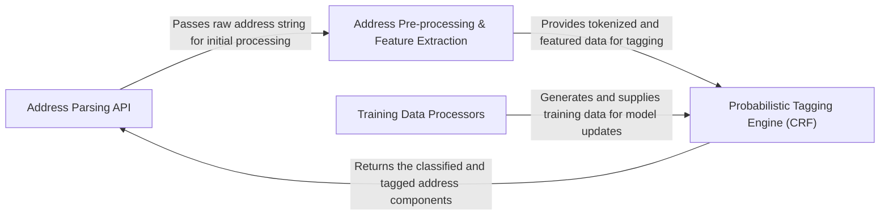

## Details

The `usaddress` library is architected as a specialized address parsing pipeline, designed for clarity in data flow and extensibility of its core probabilistic model. It features a distinct Address Parsing API as the entry point, which orchestrates the transformation of raw address strings. This transformation involves an Address Pre-processing & Feature Extraction stage, preparing data for the central Probabilistic Tagging Engine (CRF), which applies machine learning to assign address component tags. An independent Training Data Processors component supports the continuous improvement of the tagging engine by generating and supplying model training data. This modular design emphasizes the separation of concerns, allowing for independent evolution of the parsing logic and the underlying probabilistic model, making `usaddress` an ideal "Address Parsing Service" layer within larger systems.

### Address Parsing API [[Expand]](./Address_Parsing_API.md)
The public interface of the `usaddress` library, responsible for receiving raw address strings, orchestrating the parsing workflow, and returning structured address data. It serves as the primary integration point.

**Related Classes/Methods**:

- <a href="https://github.com/datamade/usaddress/blob/main/usaddress/__init__.py#L671-L680" target="_blank" rel="noopener noreferrer">`usaddress.__init__.parse`:671-680</a>

### Address Pre-processing & Feature Extraction [[Expand]](./Address_Pre_processing_Feature_Extraction.md)
Transforms raw address strings into a format suitable for the probabilistic model by tokenizing input and extracting relevant features.

**Related Classes/Methods**:

- <a href="https://github.com/datamade/usaddress/blob/main/usaddress/__init__.py#L731-L749" target="_blank" rel="noopener noreferrer">`usaddress.__init__.tokenize`:731-749</a>
- <a href="https://github.com/datamade/usaddress/blob/main/usaddress/__init__.py#L785-L807" target="_blank" rel="noopener noreferrer">`usaddress.__init__.tokens2features`:785-807</a>
- <a href="https://github.com/datamade/usaddress/blob/main/usaddress/__init__.py#L755-L782" target="_blank" rel="noopener noreferrer">`usaddress.__init__.tokenFeatures`:755-782</a>

### Probabilistic Tagging Engine (CRF) [[Expand]](./Probabilistic_Tagging_Engine_CRF_.md)
The core intelligence, encapsulating the trained Conditional Random Field (CRF) model. It applies learned patterns to features to predict and assign address component labels.

**Related Classes/Methods**:

- <a href="https://github.com/datamade/usaddress/blob/main/usaddress/__init__.py#L683-L728" target="_blank" rel="noopener noreferrer">`usaddress.__init__.tag`:683-728</a>

### Training Data Processors [[Expand]](./Training_Data_Processors.md)
Manages the ingestion and conversion of raw data sources (e.g., OpenAddress, OpenStreetMap) into the specific XML format required for training or retraining the `Probabilistic Tagging Engine (CRF)`. This is an offline process crucial for model accuracy.

**Related Classes/Methods**:

- <a href="https://github.com/datamade/usaddress/blob/main/parse_scripts/parse_openaddress.py#L8-L12" target="_blank" rel="noopener noreferrer">`parse_scripts.parse_openaddress.json2trainingxml`:8-12</a>
- <a href="https://github.com/datamade/usaddress/blob/main/parse_scripts/parse_openaddress.py#L15-L25" target="_blank" rel="noopener noreferrer">`parse_scripts.parse_openaddress.json2addrlist`:15-25</a>
- <a href="https://github.com/datamade/usaddress/blob/main/parse_scripts/parse_openaddress.py#L28-L45" target="_blank" rel="noopener noreferrer">`parse_scripts.parse_openaddress.list2xml`:28-45</a>
- <a href="https://github.com/datamade/usaddress/blob/main/parse_scripts/parse.py#L23-L68" target="_blank" rel="noopener noreferrer">`parse_scripts.parse.osmNaturalToTraining`:23-68</a>
- <a href="https://github.com/datamade/usaddress/blob/main/parse_scripts/parse.py#L71-L137" target="_blank" rel="noopener noreferrer">`parse_scripts.parse.osmSyntheticToTraining`:71-137</a>
- <a href="https://github.com/datamade/usaddress/blob/main/parse_scripts/parse.py#L8-L20" target="_blank" rel="noopener noreferrer">`parse_scripts.parse.xmlToAddrList`:8-20</a>

### [FAQ](https://github.com/CodeBoarding/GeneratedOnBoardings/tree/main?tab=readme-ov-file#faq)