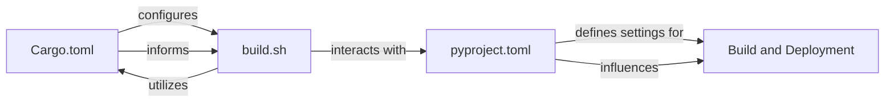

## Details

Abstract Components Overview

### Build and Deployment [[Expand]](./Build_and_Deployment.md)
This component defines the project's build process, manages external dependencies, and outlines the instructions for packaging and deploying the module. It ensures that the Rust source code can be compiled into a loadable Valkey module, tested, and prepared for distribution.

**Related Classes/Methods**:

- `Cargo.toml`
- `build.sh`
- `pyproject.toml`

### Cargo.toml
Defines Rust project metadata, dependencies, and build configurations.

**Related Classes/Methods**:

- `Cargo.toml`

### build.sh
A shell script likely orchestrating the build, test, and packaging processes.

**Related Classes/Methods**:

- `build.sh`

### pyproject.toml
Used for Python project configuration, potentially for testing or packaging the module.

**Related Classes/Methods**:

- `pyproject.toml`

### [FAQ](https://github.com/CodeBoarding/GeneratedOnBoardings/tree/main?tab=readme-ov-file#faq)