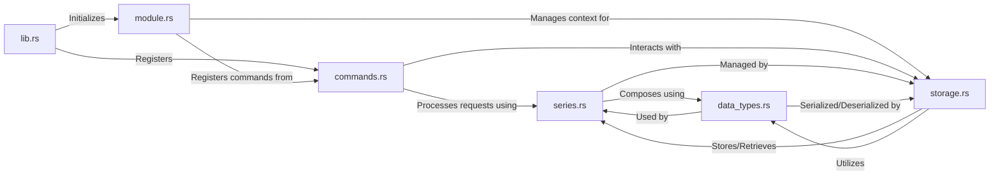

## Details

The `Core Module Logic` forms the foundational subsystem of the `valkey-timeseries` module, encapsulating the core Rust implementations for time series data management. It is designed around efficient in-memory operations and direct interaction with the Valkey module API.

### lib.rs
This is the primary entry point for the entire Valkey module. It orchestrates the initialization of other core components and registers the module's commands with the Valkey server upon loading.

**Related Classes/Methods**:

- `lib.rs` (1:1000)

### module.rs
Handles the low-level interface and lifecycle events with the Valkey module API. It manages the module's global state and ensures proper integration with the Valkey server environment.

**Related Classes/Methods**:

- `module.rs` (1:1000)

### commands.rs
Implements the logic for all `TS.*` commands exposed by the Valkey module. It is responsible for parsing command arguments, validating input, and delegating operations to the appropriate data structures and storage mechanisms.

**Related Classes/Methods**:

- `commands.rs` (1:1000)

### series.rs
Defines the core data structures for individual time series, including the representation of samples, labels, and metadata. It manages the internal state and operations related to a single time series object.

**Related Classes/Methods**:

- `series.rs` (1:1000)

### data_types.rs
Defines fundamental, reusable data types such as `Sample`, `Label`, `Timestamp`, and other basic building blocks used consistently across the module to ensure data integrity and representation.

**Related Classes/Methods**:

- `data_types.rs` (1:1000)

### storage.rs
Manages the efficient in-memory storage of all time series data. It implements retention policies, data encoding, and compression strategies to optimize memory usage and access speed, providing an interface for command handlers to store and retrieve time series.

**Related Classes/Methods**:

- `storage.rs` (1:1000)

### [FAQ](https://github.com/CodeBoarding/GeneratedOnBoardings/tree/main?tab=readme-ov-file#faq)