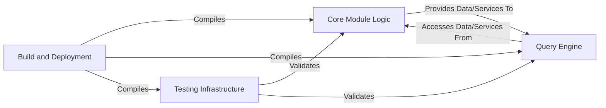

## Details

The `valkey-timeseries` module is architected around a `Core Module Logic` component, which serves as the central data management unit for time series data, handling storage, retention, and exposing core functionalities through Valkey commands. A `Query Engine` component interacts with the `Core Module Logic` to parse and execute complex queries, leveraging indexing for efficient data retrieval. The entire system's reliability is ensured by the `Testing Infrastructure`, which validates both the core logic and query capabilities. Finally, the `Build and Deployment` component manages the compilation and packaging of all module components, facilitating its integration and deployment within a Valkey instance. This architecture enables efficient in-memory time series operations as an extension to Valkey.

### Core Module Logic [[Expand]](./Core_Module_Logic.md)
This component forms the heart of the `valkey-timeseries` module. It encompasses the fundamental Rust implementations for managing time series data, including internal representations for samples, labels, and metadata. It is responsible for efficient in-memory storage, applying retention policies, and handling data encoding/compression. Crucially, it also contains the command handlers that directly interface with the Valkey module API, exposing the module's functionalities to the Valkey server. `src/lib.rs` is identified as the main entry point and orchestrator for the module's core functionalities.

**Related Classes/Methods**:

- `src/lib.rs` (1:1)
- `src/commands.rs` (1:1)
- `src/series.rs` (1:1)
- `src/data_types.rs` (1:1)
- `src/storage.rs` (1:1)
- `src/module.rs` (1:1)

### Query Engine [[Expand]](./Query_Engine.md)
This component is dedicated to processing and executing queries against the time series data managed by the `Core Module Logic`. It handles the parsing of user-provided query arguments, translates them into internal operations, and leverages efficient indexing mechanisms for metadata and label-based filtering. The Query Engine relies on the Core Module Logic for accessing and manipulating the underlying time series data.

**Related Classes/Methods**:

- `src/query.rs` (1:1)
- `src/filter.rs` (1:1)
- `src/index.rs` (1:1)

### Testing Infrastructure
This component provides the necessary framework and code for verifying the correctness, robustness, and performance of the `valkey-timeseries` module. It includes unit tests for individual components and integration tests designed to ensure proper interaction with a running Valkey instance and validate end-to-end functionality.

**Related Classes/Methods**:

- `tests/integration_tests.rs` (1:1)

### Build and Deployment [[Expand]](./Build_and_Deployment.md)
This component defines the project's build process, manages external dependencies, and outlines the instructions for packaging and deploying the module. It ensures that the Rust source code can be compiled into a loadable Valkey module, tested, and prepared for distribution.

**Related Classes/Methods**:

- `Cargo.toml` (1:1)
- `build.sh` (1:1)

### [FAQ](https://github.com/CodeBoarding/GeneratedOnBoardings/tree/main?tab=readme-ov-file#faq)