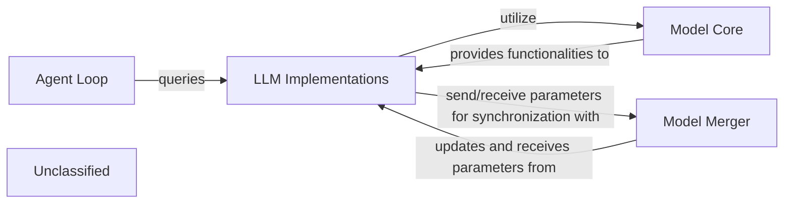

## Details

The `verl` project's core architecture is designed around modularity and extensibility, primarily focusing on Large Language Model (LLM) integration and reinforcement learning (RL) agent training. It comprises distinct components for managing LLM implementations, providing a unified model core, orchestrating agent interactions, and facilitating distributed model parameter synchronization. This structure enables flexible experimentation with various LLM architectures and efficient scaling for training and deployment.

### LLM Implementations
Encapsulates specific Large Language Model architectures (e.g., Llama, Qwen2) and their specialized components for distributed training (e.g., Megatron-LM integration). These are the core generative models that produce responses.

**Related Classes/Methods**:

- <a href="https://github.com/volcengine/verl/blob/mainverl/models/llama/megatron/modeling_llama_megatron.py" target="_blank" rel="noopener noreferrer">`verl.models.llama.megatron.modeling_llama_megatron.MegatronLlamaModel`</a>
- <a href="https://github.com/volcengine/verl/blob/mainverl/models/qwen2/megatron/modeling_qwen2_megatron.py" target="_blank" rel="noopener noreferrer">`verl.models.qwen2.megatron.modeling_qwen2_megatron.MegatronQwen2Model`</a>

### Model Core
Provides common utilities and an abstraction layer for interacting with various LLM backends. It handles tasks such as configuration conversion, model initialization, and checkpoint management, offering a unified interface for different LLM architectures.

**Related Classes/Methods**:

- <a href="https://github.com/volcengine/verl/blob/mainverl/models/mcore/mbridge.py" target="_blank" rel="noopener noreferrer">`verl.models.mcore.mbridge.MBridge`</a>

### Agent Loop
Manages the agent's interaction cycle within the RL environment. It is responsible for generating agent actions or responses based on processed observations by querying the underlying LLM implementations.

**Related Classes/Methods**:

- <a href="https://github.com/volcengine/verl/blob/mainverl/experimental/agent_loop/agent_loop.py" target="_blank" rel="noopener noreferrer">`verl.experimental.agent_loop.agent_loop.AgentLoop`</a>

### Model Merger
Facilitates the merging and synchronization of LLM parameters across different workers or replicas during distributed training. This ensures model consistency and efficient parameter updates in a distributed environment.

**Related Classes/Methods**:

- <a href="https://github.com/volcengine/verl/blob/mainverl/model_merger/base_model_merger.py#L162-L362" target="_blank" rel="noopener noreferrer">`verl.model_merger.base_model_merger.BaseModelMerger`:162-362</a>

### Unclassified
Component for all unclassified files and utility functions (Utility functions/External Libraries/Dependencies)

**Related Classes/Methods**: _None_

### [FAQ](https://github.com/CodeBoarding/GeneratedOnBoardings/tree/main?tab=readme-ov-file#faq)