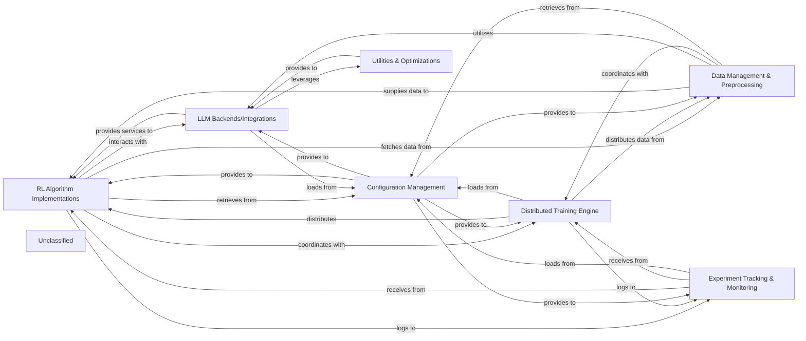

## Details

The `verl` project implements a robust and scalable framework for Reinforcement Learning with Large Language Models. At its core, `RL Algorithm Implementations` drive the learning process, interacting directly with `LLM Backends/Integrations` for model inference and gradient application. Data flow is managed by `Data Management & Preprocessing`, which supplies prepared data to the algorithms and coordinates with `LLM Backends/Integrations` for tokenization. For large-scale training, the `Distributed Training Engine` orchestrates parallel execution across multiple devices and nodes, distributing both algorithm logic and data. All operational parameters, from algorithm hyperparameters to distributed settings, are centrally managed by `Configuration Management`. Throughout the training lifecycle, `Experiment Tracking & Monitoring` collects and visualizes critical metrics, ensuring reproducibility and insight. Finally, `Utilities & Optimizations` provides performance-critical enhancements, primarily benefiting `LLM Backends/Integrations` to ensure efficient LLM operations. This architecture emphasizes modularity and scalability, enabling efficient development and deployment of advanced RL-LLM systems.

### RL Algorithm Implementations
Encapsulates the core logic for various Reinforcement Learning algorithms. It manages policy and value function updates, reward modeling, and loss calculations specific to each algorithm.

**Related Classes/Methods**:

- <a href="https://github.com/volcengine/verl/blob/mainverl/trainer/ppo/ray_trainer.py#L263-L1331" target="_blank" rel="noopener noreferrer">`verl.trainer.ppo.ray_trainer.RayPPOTrainer`:263-1331</a>
- `verl.trainer.grpo.ray_trainer.RayGRPOTrainer`:1-10
- `verl.rl_algorithms.base_algorithm.BaseAlgorithm`

### LLM Backends/Integrations
Provides a standardized interface for integrating with and managing different Large Language Model frameworks and serving engines. It handles model loading, tokenization, inference, and provides mechanisms for applying gradients to the LLM.

**Related Classes/Methods**:

- `verl.llm_backends.huggingface_adapter.HuggingFaceAdapter`
- `verl.llm_backends.vllm_adapter.VLLMAdapter`
- `verl.llm_backends.base_llm_interface.BaseLLMInterface`

### Distributed Training Engine
Manages the distributed execution of RL training workflows. It leverages frameworks like Ray, FSDP, and DeepSpeed Ulysses to orchestrate worker processes, handle data parallelism, model parallelism, and ensure efficient communication and synchronization across multiple GPUs and nodes.

**Related Classes/Methods**:

- `verl.distributed_engine.ray_orchestrator.RayOrchestrator`:10-25
- <a href="https://github.com/volcengine/verl/blob/mainverl/utils/fsdp_utils.py" target="_blank" rel="noopener noreferrer">`verl.utils.fsdp_utils.FSDPManager`</a>

### Data Management & Preprocessing
Responsible for the entire data pipeline, including loading raw datasets, performing necessary preprocessing steps, creating efficient data loaders, and managing replay buffers for experience collection and sampling.

**Related Classes/Methods**:

- <a href="https://github.com/volcengine/verl/blob/mainverl/utils/memory_buffer.py" target="_blank" rel="noopener noreferrer">`verl.utils.memory_buffer.ReplayBuffer`</a>

### Configuration Management
Provides a centralized system for defining, loading, and managing all configurable parameters of the training system. This includes algorithm hyperparameters, LLM-specific settings, distributed training configurations, and experiment logging preferences, ensuring reproducibility and ease of experimentation.

**Related Classes/Methods**:

- <a href="https://github.com/volcengine/verl/blob/mainverl/utils/config.py" target="_blank" rel="noopener noreferrer">`verl.utils.config.ConfigManager`</a>
- <a href="https://github.com/volcengine/verl/blob/mainverl/utils/config.py" target="_blank" rel="noopener noreferrer">`verl.utils.config.ConfigParser`</a>

### Experiment Tracking & Monitoring
Integrates with various experiment tracking platforms to log training metrics, model checkpoints, system resource utilization, and visualize training progress over time.

**Related Classes/Methods**:

- <a href="https://github.com/volcengine/verl/blob/mainverl/utils/logger/aggregate_logger.py" target="_blank" rel="noopener noreferrer">`verl.utils.logger.aggregate_logger.AggregateLogger`</a>

### Utilities & Optimizations
Contains a collection of performance-critical utilities and optimization techniques. This includes specialized components like Flash Attention 2, LoRA adapters, and other low-level performance enhancements crucial for efficient LLM training on various hardware.

**Related Classes/Methods**:

- `verl.model_merger.lora_adapter.LoRAAdapter`:10-25
- <a href="https://github.com/volcengine/verl/blob/mainverl/utils/kernel/kernels.py" target="_blank" rel="noopener noreferrer">`verl.utils.kernel.kernels.CudaKernels`</a>

### Unclassified
Component for all unclassified files and utility functions (Utility functions/External Libraries/Dependencies)

**Related Classes/Methods**: _None_

### [FAQ](https://github.com/CodeBoarding/GeneratedOnBoardings/tree/main?tab=readme-ov-file#faq)