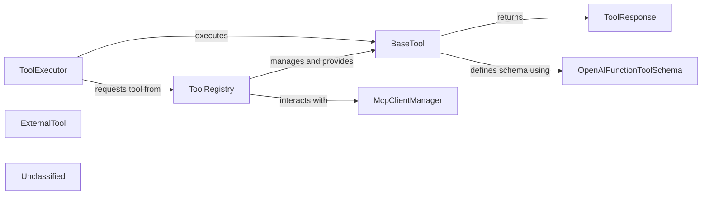

## Details

The verl.tools subsystem provides a robust framework for integrating and managing various tools, enabling a language model to interact with external functionalities. At its core, the ToolRegistry is responsible for discovering, initializing, and providing access to both native and Multi-Cloud Platform (MCP) tools. The ToolExecutor acts as the orchestrator, taking requests from the language model, retrieving the appropriate tool from the ToolRegistry, and executing it. All tools adhere to a common interface defined by BaseTool, ensuring consistent interaction. Tool capabilities are described using OpenAIFunctionToolSchema, and their execution results are standardized through ToolResponse. The MCPClientManager facilitates the dynamic discovery and integration of external MCP tools, extending the system's capabilities.

### ToolExecutor [[Expand]](./ToolExecutor.md)
Orchestrates the execution of external tools or APIs. It acts as the bridge between the language model's request for a tool and the actual tool's execution, ensuring the correct tool is retrieved and invoked with the provided parameters.

**Related Classes/Methods**:

- <a href="https://github.com/volcengine/verl/blob/mainverl/tools/base_tool.py#L62-L74" target="_blank" rel="noopener noreferrer">`verl.tools.base_tool.BaseTool.execute`:62-74</a>

### ToolRegistry
Manages the registration, initialization, and retrieval of all available tools, including both native verl tools and external Multi-Cloud Platform (MCP) tools. It ensures tools are properly configured and accessible.

**Related Classes/Methods**:

- <a href="https://github.com/volcengine/verl/blob/mainverl/tools/utils/tool_registry.py#L82-L130" target="_blank" rel="noopener noreferrer">`verl.tools.utils.tool_registry.initialize_tools_from_config`:82-130</a>

### BaseTool
Serves as the abstract base class for all tools, defining the common interface for tool interactions such as execution, schema generation, reward calculation, and resource management.

**Related Classes/Methods**:

- <a href="https://github.com/volcengine/verl/blob/mainverl/tools/base_tool.py#L24-L93" target="_blank" rel="noopener noreferrer">`verl.tools.base_tool.BaseTool`:24-93</a>

### ExternalTool
Represents a conceptual grouping of concrete tools that inherit from BaseTool, encapsulating the logic for their execution and interaction with external systems or APIs.

**Related Classes/Methods**:

- <a href="https://github.com/volcengine/verl/blob/mainverl/tools/base_tool.py#L24-L93" target="_blank" rel="noopener noreferrer">`verl.tools.base_tool.BaseTool`:24-93</a>

### OpenAIFunctionToolSchema
A data structure used to define the capabilities and input parameters of a tool in a standardized, OpenAI-compatible format, enabling language models to understand and invoke tools correctly.

**Related Classes/Methods**:

- <a href="https://github.com/volcengine/verl/blob/mainverl/tools/schemas.py#L48-L52" target="_blank" rel="noopener noreferrer">`verl.tools.schemas.OpenAIFunctionToolSchema`:48-52</a>

### ToolResponse
A standardized data structure for encapsulating the outcome, status, and any relevant data returned by a tool after its execution, ensuring consistent communication of results.

**Related Classes/Methods**:

- <a href="https://github.com/volcengine/verl/blob/mainverl/tools/schemas.py#L94-L123" target="_blank" rel="noopener noreferrer">`verl.tools.schemas.ToolResponse`:94-123</a>

### McpClientManager
Manages client connections and communication with Multi-Cloud Platform (MCP) services to dynamically discover and fetch external tool definitions and configurations.

**Related Classes/Methods**:

- <a href="https://github.com/volcengine/verl/blob/mainverl/tools/utils/mcp_clients/McpClientManager.py#L28-L94" target="_blank" rel="noopener noreferrer">`verl.tools.utils.mcp_clients.McpClientManager.MCPClientManager`:28-94</a>

### Unclassified
Component for all unclassified files and utility functions (Utility functions/External Libraries/Dependencies)

**Related Classes/Methods**: _None_

### [FAQ](https://github.com/CodeBoarding/GeneratedOnBoardings/tree/main?tab=readme-ov-file#faq)