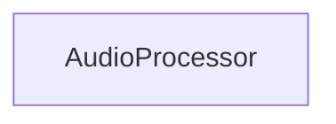

## Details

One paragraph explaining the functionality which is represented by this graph. What the main flow is and what is its purpose.

### AudioProcessor
A collection of utility functions for audio processing.

**Related Classes/Methods**:

- <a href="https://github.com/haoheliu/versatile_audio_super_resolution/blob/main/audiosr/utilities/audio/tools.py" target="_blank" rel="noopener noreferrer">`audiosr.utilities.audio.tools.AudioProcessor`</a>

### [FAQ](https://github.com/CodeBoarding/GeneratedOnBoardings/tree/main?tab=readme-ov-file#faq)