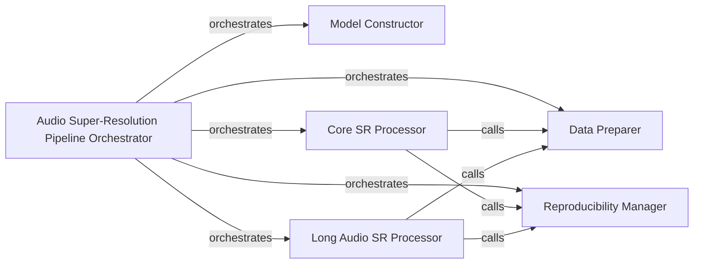

## Details

The Audio Super-Resolution Pipeline Orchestrator subsystem manages and executes the audio super-resolution workflow, acting as the central coordinator for model setup and task execution.

### Audio Super-Resolution Pipeline Orchestrator [[Expand]](./Audio_Super_Resolution_Pipeline_Orchestrator.md)
This is the overarching component, representing the `audiosr.pipeline` module itself. It acts as the central coordinator, defining and managing the sequence of operations for the entire audio super-resolution process, from model setup to execution of super-resolution tasks. It serves as the primary entry point for initiating the workflow.

**Related Classes/Methods**:

- <a href="https://github.com/haoheliu/versatile_audio_super_resolution/blob/main/audiosr/pipeline.py" target="_blank" rel="noopener noreferrer">`audiosr.pipeline`</a>

### Model Constructor
Responsible for initializing, loading, and configuring the necessary machine learning model(s) required for the super-resolution task. This component ensures the model is prepared and ready for inference. It's crucial for the ML core of the application.

**Related Classes/Methods**:

- <a href="https://github.com/haoheliu/versatile_audio_super_resolution/blob/main/audiosr/pipeline.py#L141-L177" target="_blank" rel="noopener noreferrer">`audiosr.pipeline.build_model`:141-177</a>

### Data Preparer
Handles the essential task of transforming, normalizing, and batching raw audio data into the specific format required by the super-resolution model. This component is vital for feeding correctly formatted input to the ML model.

**Related Classes/Methods**:

- <a href="https://github.com/haoheliu/versatile_audio_super_resolution/blob/main/audiosr/pipeline.py#L87-L134" target="_blank" rel="noopener noreferrer">`audiosr.pipeline.make_batch_for_super_resolution`:87-134</a>

### Reproducibility Manager
Ensures the consistency and reproducibility of super-resolution results by setting random seeds across relevant libraries and operations. This is a critical support component for any ML application to guarantee reliable and verifiable outcomes.

**Related Classes/Methods**:

- <a href="https://github.com/haoheliu/versatile_audio_super_resolution/blob/main/audiosr/pipeline.py#L26-L37" target="_blank" rel="noopener noreferrer">`audiosr.pipeline.seed_everything`:26-37</a>

### Core SR Processor
Executes the super-resolution process for standard (short to medium) audio inputs. This component embodies the direct application of the super-resolution model to prepared data.

**Related Classes/Methods**:

- <a href="https://github.com/haoheliu/versatile_audio_super_resolution/blob/main/audiosr/pipeline.py#L180-L202" target="_blank" rel="noopener noreferrer">`audiosr.pipeline.super_resolution`:180-202</a>

### Long Audio SR Processor
Manages super-resolution for extended audio inputs, likely involving chunking, iterative processing, and reassembly to optimize resource usage and handle larger files efficiently. This is a specialized processing component for a common ML application challenge.

**Related Classes/Methods**:

- <a href="https://github.com/haoheliu/versatile_audio_super_resolution/blob/main/audiosr/pipeline.py#L205-L332" target="_blank" rel="noopener noreferrer">`audiosr.pipeline.super_resolution_long_audio`:205-332</a>

### [FAQ](https://github.com/CodeBoarding/GeneratedOnBoardings/tree/main?tab=readme-ov-file#faq)