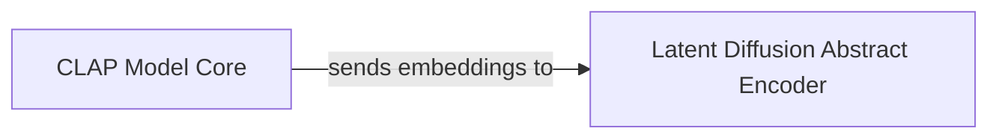

## Details

The Conditioning Encoder subsystem is responsible for generating contextual embeddings from various inputs (e.g., text, reference audio) that serve as guidance for the main Diffusion Model Core.

### CLAP Model Core
This component is responsible for generating joint audio and text embeddings. It processes raw audio and/or text inputs to produce a unified, high-level representation in an embedding space, enabling cross-modal understanding.

**Related Classes/Methods**:

- <a href="https://github.com/haoheliu/versatile_audio_super_resolution/blob/main/audiosr/clap/open_clip/model.py" target="_blank" rel="noopener noreferrer">`audiosr.clap.open_clip.model:CLAP`</a>

### Latent Diffusion Abstract Encoder
This component defines the interface and common functionalities for encoders within the latent diffusion framework. Its primary role is to take the initial embeddings (e.g., from the CLAP Model Core) and transform them into the specific conditioning format required by the Diffusion Model Core. This transformation may involve dimensionality reduction, projection, or other specialized processing steps.

**Related Classes/Methods**:

- <a href="https://github.com/haoheliu/versatile_audio_super_resolution/blob/main/audiosr/latent_diffusion/modules/encoders/modules.py" target="_blank" rel="noopener noreferrer">`audiosr.latent_diffusion.modules.encoders.modules:AbstractEncoder`</a>

### [FAQ](https://github.com/CodeBoarding/GeneratedOnBoardings/tree/main?tab=readme-ov-file#faq)