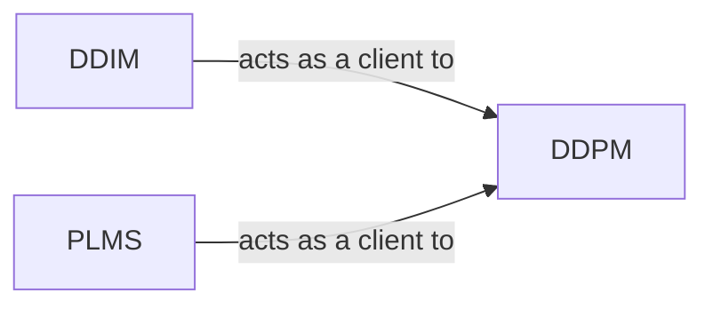

## Details

The `Diffusion Model Core` subsystem is responsible for the primary generative machine learning model, which iteratively refines latent representations for the super-resolution task.

### DDPM
This is the foundational and central component of the `Diffusion Model Core`. It embodies the complete diffusion process, including forward and reverse diffusion, training mechanisms, and core model interactions. It manages the model's lifecycle, calculates losses, handles interactions within the latent space, and performs initial audio post-processing steps.

**Related Classes/Methods**:

- <a href="https://github.com/haoheliu/versatile_audio_super_resolution/blob/main/audiosr/latent_diffusion/models/ddpm.py#L49-L585" target="_blank" rel="noopener noreferrer">`audiosr.latent_diffusion.models.ddpm.DDPM`:49-585</a>

### DDIM
A specialized component that provides a faster, deterministic sampling strategy for the latent diffusion model. It manages its own specific schedule and implements the DDIM (Denoising Diffusion Implicit Models) sampling algorithm, offering an alternative to the probabilistic sampling of DDPM.

**Related Classes/Methods**:

- <a href="https://github.com/haoheliu/versatile_audio_super_resolution/blob/main/audiosr/latent_diffusion/models/ddim.py" target="_blank" rel="noopener noreferrer">`audiosr.latent_diffusion.models.ddim.DDIM`</a>

### PLMS
Another specialized component offering an accelerated deterministic sampling method, distinct from DDIM. It manages its specific schedule and implements the PLMS (Pseudo Linear Multistep) sampling algorithm, providing another efficient inference option for the diffusion model.

**Related Classes/Methods**:

- <a href="https://github.com/haoheliu/versatile_audio_super_resolution/blob/main/audiosr/latent_diffusion/models/plms.py" target="_blank" rel="noopener noreferrer">`audiosr.latent_diffusion.models.plms.PLMS`</a>

### [FAQ](https://github.com/CodeBoarding/GeneratedOnBoardings/tree/main?tab=readme-ov-file#faq)