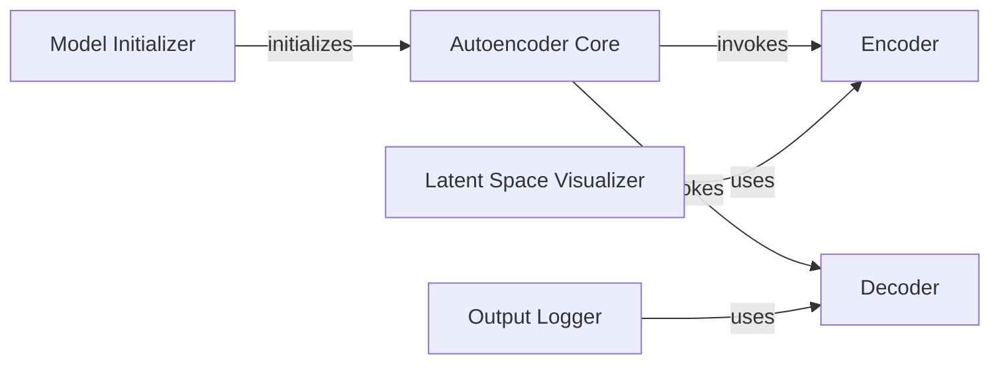

## Details

The Latent Space Autoencoder subsystem is encapsulated within the audiosr.latent_encoder.autoencoder module. It is responsible for the core functionality of transforming high-dimensional audio features into a compact latent space and reconstructing them, which is vital for the efficiency of the diffusion model.

### Autoencoder Core
Acts as the central orchestrator for the entire autoencoding process, managing the encoding and decoding operations. It provides the primary interface for interacting with the latent space model.

**Related Classes/Methods**:

- <a href="https://github.com/haoheliu/versatile_audio_super_resolution/blob/main/audiosr/latent_encoder/autoencoder.py#L18-L306" target="_blank" rel="noopener noreferrer">`audiosr.latent_encoder.autoencoder.Autoencoder`:18-306</a>

### Encoder [[Expand]](./Encoder.md)
Responsible for transforming high-dimensional input audio features into a lower-dimensional, compact latent representation. This is the forward pass of the encoder part of the autoencoder.

**Related Classes/Methods**:

- <a href="https://github.com/haoheliu/versatile_audio_super_resolution/blob/main/audiosr/latent_encoder/autoencoder.py#L314-L315" target="_blank" rel="noopener noreferrer">`audiosr.latent_encoder.autoencoder.encode`:314-315</a>

### Decoder
Reconstructs audio features from a given latent representation, performing the inverse transformation of the encoder. This is the forward pass of the decoder part of the autoencoder.

**Related Classes/Methods**:

- <a href="https://github.com/haoheliu/versatile_audio_super_resolution/blob/main/audiosr/latent_encoder/autoencoder.py#L317-L318" target="_blank" rel="noopener noreferrer">`audiosr.latent_encoder.autoencoder.decode`:317-318</a>

### Model Initializer
Handles the initialization of the autoencoder's parameters by loading pre-trained weights or configurations from a specified checkpoint file, ensuring the model is ready for inference.

**Related Classes/Methods**:

- <a href="https://github.com/haoheliu/versatile_audio_super_resolution/blob/main/audiosr/latent_encoder/autoencoder.py#L92-L101" target="_blank" rel="noopener noreferrer">`audiosr.latent_encoder.autoencoder.init_from_ckpt`:92-101</a>

### Latent Space Visualizer
Provides utility for visualizing the encoded latent space, aiding in debugging and understanding the model's learned representations.

**Related Classes/Methods**:

- <a href="https://github.com/haoheliu/versatile_audio_super_resolution/blob/main/audiosr/latent_encoder/autoencoder.py#L130-L174" target="_blank" rel="noopener noreferrer">`audiosr.latent_encoder.autoencoder.visualize_latent`:130-174</a>

### Output Logger
Manages the logging of reconstructed audio features, often converting them into a visual format (e.g., images or waveforms) for monitoring and evaluation. It utilizes helper methods for format conversion.

**Related Classes/Methods**:

- <a href="https://github.com/haoheliu/versatile_audio_super_resolution/blob/main/audiosr/latent_encoder/autoencoder.py#L212-L223" target="_blank" rel="noopener noreferrer">`audiosr.latent_encoder.autoencoder.log_images`:212-223</a>
- <a href="https://github.com/haoheliu/versatile_audio_super_resolution/blob/main/audiosr/latent_encoder/autoencoder.py#L225-L295" target="_blank" rel="noopener noreferrer">`audiosr.latent_encoder.autoencoder._log_img`:225-295</a>

### [FAQ](https://github.com/CodeBoarding/GeneratedOnBoardings/tree/main?tab=readme-ov-file#faq)