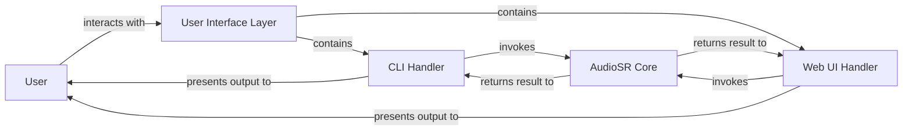

## Details

The `versatile_audio_super_resolution` project is structured around a clear separation of concerns, with a `User Interface Layer` serving as the primary interaction point for users. This layer encompasses both a `CLI Handler` for command-line operations and a `Web UI Handler` for a browser-based experience. Both handlers act as intermediaries, receiving input from the `User` and delegating the core audio processing tasks to the `AudioSR Core` component. The `AudioSR Core` performs the actual super-resolution, returning the processed audio back to the respective handler, which then presents the final output to the `User`. This architecture ensures flexibility in user interaction while centralizing the complex audio processing logic.

### User
Represents the external user who initiates audio super-resolution requests and receives the processed audio output. The user interacts with the system through either the command-line interface or the web user interface.

**Related Classes/Methods**: _None_

### User Interface Layer [[Expand]](./User_Interface_Layer.md)
The primary entry point for user interaction, encompassing both command-line and web-based interfaces. It is responsible for capturing user input (audio files, parameters) and presenting the super-resolved results. This layer acts as a facade for the underlying `CLI Handler` and `Web UI Handler` components.

**Related Classes/Methods**:

- <a href="https://github.com/haoheliu/versatile_audio_super_resolution/blob/main/audiosr/__main__.py" target="_blank" rel="noopener noreferrer">`audiosr.__main__.py`</a>
- <a href="https://github.com/haoheliu/versatile_audio_super_resolution/blob/main/app.py" target="_blank" rel="noopener noreferrer">`app.py`</a>

### CLI Handler
Manages the command-line interface, parsing arguments, validating inputs, and orchestrating the audio super-resolution process for CLI users. It acts as an intermediary, receiving input from the `User` and delegating the core processing to the `AudioSR Core` component.

**Related Classes/Methods**:

- <a href="https://github.com/haoheliu/versatile_audio_super_resolution/blob/main/audiosr/__main__.py" target="_blank" rel="noopener noreferrer">`audiosr.__main__.py`</a>

### Web UI Handler
Sets up and manages the Gradio web interface, handling file uploads, parameter adjustments via sliders, and displaying the super-resolved audio results. It provides an interactive, browser-based experience, mediating between the `User` and the `AudioSR Core`.

**Related Classes/Methods**:

- <a href="https://github.com/haoheliu/versatile_audio_super_resolution/blob/main/app.py" target="_blank" rel="noopener noreferrer">`app.py`</a>

### AudioSR Core
The central processing engine of the system, responsible for executing the audio super-resolution algorithms. It receives audio data and processing parameters from the `CLI Handler` or `Web UI Handler` and returns the enhanced audio. This component encapsulates the core logic of the `audiosr.core.AudioSR` class.

**Related Classes/Methods**:

### [FAQ](https://github.com/CodeBoarding/GeneratedOnBoardings/tree/main?tab=readme-ov-file#faq)