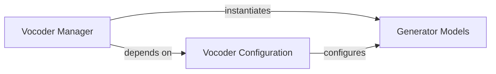

## Details

The Vocoder subsystem is responsible for synthesizing high-resolution audio waveforms from features provided by the Diffusion Model Core. It encapsulates the neural network models for audio generation and the utilities for their configuration and lifecycle management.

### Generator Models
These are the core neural network components responsible for synthesizing high-resolution audio waveforms from input features. They encapsulate the specific architecture and forward pass logic for audio generation. The subsystem includes two versions of this model.

**Related Classes/Methods**:

- <a href="https://github.com/haoheliu/versatile_audio_super_resolution/blob/main/audiosr/hifigan/models.py#L112-L174" target="_blank" rel="noopener noreferrer">`audiosr.hifigan.models.Generator`:112-174</a>
- <a href="https://github.com/haoheliu/versatile_audio_super_resolution/blob/main/audiosr/hifigan/models_v2.py#L154-L218" target="_blank" rel="noopener noreferrer">`audiosr.hifigan.models_v2.Generator`:154-218</a>

### Vocoder Manager
This component manages the lifecycle of the vocoder. It is responsible for selecting the appropriate Generator model version, loading its pre-trained weights, and preparing it for inference. It acts as an abstraction layer for obtaining a ready-to-use vocoder instance.

**Related Classes/Methods**:

- <a href="https://github.com/haoheliu/versatile_audio_super_resolution/blob/main/audiosr/utilities/model.py#L110-L149" target="_blank" rel="noopener noreferrer">`audiosr.utilities.model.get_vocoder`:110-149</a>

### Vocoder Configuration
This component provides the specific architectural and operational parameters required to correctly initialize and configure the Generator Models. It defines different sets of parameters, such as those optimized for 48kHz audio.

**Related Classes/Methods**:

- <a href="https://github.com/haoheliu/versatile_audio_super_resolution/blob/main/audiosr/utilities/model.py#L6-L37" target="_blank" rel="noopener noreferrer">`audiosr.utilities.model.get_vocoder_config`:6-37</a>
- <a href="https://github.com/haoheliu/versatile_audio_super_resolution/blob/main/audiosr/utilities/model.py#L40-L70" target="_blank" rel="noopener noreferrer">`audiosr.utilities.model.get_vocoder_config_48k`:40-70</a>

### [FAQ](https://github.com/CodeBoarding/GeneratedOnBoardings/tree/main?tab=readme-ov-file#faq)