```mermaid
graph LR
    User_Interface_Layer["User Interface Layer"]
    Audio_Super_Resolution_Pipeline_Orchestrator["Audio Super-Resolution Pipeline Orchestrator"]
    Audio_I_O_Preprocessing_Module["Audio I/O & Preprocessing Module"]
    Latent_Space_Autoencoder["Latent Space Autoencoder"]
    Diffusion_Model_Core["Diffusion Model Core"]
    Conditioning_Encoder["Conditioning Encoder"]
    Vocoder["Vocoder"]
    Core_Utilities_Configuration["Core Utilities & Configuration"]
    User_Interface_Layer -- "initiates process" --> Audio_Super_Resolution_Pipeline_Orchestrator
    Audio_Super_Resolution_Pipeline_Orchestrator -- "directs input to" --> Audio_I_O_Preprocessing_Module
    Audio_I_O_Preprocessing_Module -- "feeds processed features to" --> Latent_Space_Autoencoder
    Latent_Space_Autoencoder -- "feeds reduced features to" --> Diffusion_Model_Core
    Conditioning_Encoder -- "guides" --> Diffusion_Model_Core
    Diffusion_Model_Core -- "outputs refined latent representations to" --> Latent_Space_Autoencoder
    Latent_Space_Autoencoder -- "feeds decoded features to" --> Vocoder
    Vocoder -- "returns synthesized audio to" --> Audio_Super_Resolution_Pipeline_Orchestrator
    Audio_Super_Resolution_Pipeline_Orchestrator -- "returns output to" --> User_Interface_Layer
    Core_Utilities_Configuration -- "provides services to" --> Latent_Space_Autoencoder
    Core_Utilities_Configuration -- "provides services to" --> Diffusion_Model_Core
    Core_Utilities_Configuration -- "provides services to" --> Vocoder
    click User_Interface_Layer href "https://github.com/CodeBoarding/GeneratedOnBoardings/blob/main/versatile_audio_super_resolution/User_Interface_Layer.md" "Details"
    click Audio_Super_Resolution_Pipeline_Orchestrator href "https://github.com/CodeBoarding/GeneratedOnBoardings/blob/main/versatile_audio_super_resolution/Audio_Super_Resolution_Pipeline_Orchestrator.md" "Details"
    click Audio_I_O_Preprocessing_Module href "https://github.com/CodeBoarding/GeneratedOnBoardings/blob/main/versatile_audio_super_resolution/Audio_I_O_Preprocessing_Module.md" "Details"
    click Latent_Space_Autoencoder href "https://github.com/CodeBoarding/GeneratedOnBoardings/blob/main/versatile_audio_super_resolution/Latent_Space_Autoencoder.md" "Details"
    click Diffusion_Model_Core href "https://github.com/CodeBoarding/GeneratedOnBoardings/blob/main/versatile_audio_super_resolution/Diffusion_Model_Core.md" "Details"
    click Conditioning_Encoder href "https://github.com/CodeBoarding/GeneratedOnBoardings/blob/main/versatile_audio_super_resolution/Conditioning_Encoder.md" "Details"
    click Vocoder href "https://github.com/CodeBoarding/GeneratedOnBoardings/blob/main/versatile_audio_super_resolution/Vocoder.md" "Details"
    click Core_Utilities_Configuration href "https://github.com/CodeBoarding/GeneratedOnBoardings/blob/main/versatile_audio_super_resolution/Core_Utilities_Configuration.md" "Details"
```

## Details

The `versatile_audio_super_resolution` project implements a robust audio super-resolution pipeline, designed with clear component separation for efficient data flow and modularity. The `User Interface Layer` serves as the primary interaction point, directing requests to the `Audio Super-Resolution Pipeline Orchestrator`. This orchestrator meticulously guides audio data through a series of specialized modules: the `Audio I/O & Preprocessing Module` for initial data handling and feature extraction, the `Latent Space Autoencoder` for efficient dimensionality transformation, and the `Diffusion Model Core` which performs the core super-resolution task, potentially enhanced by a `Conditioning Encoder`. Finally, the `Vocoder` reconstructs the high-resolution audio waveform, which is then returned to the user. The entire process is underpinned by the `Core Utilities & Configuration` component, ensuring seamless model loading and parameter management. This architecture emphasizes a linear data flow through the ML pipeline, with clear entry and exit points, making it ideal for visual representation as a flow graph.

### User Interface Layer [[Expand]](./User_Interface_Layer.md)
The entry point for user interaction, handling input audio and parameters, and presenting the final super-resolved output.

**Related Classes/Methods**:

- <a href="https://github.com/haoheliu/versatile_audio_super_resolution/blob/main/audiosr/__main__.py#L1-L1000" target="_blank" rel="noopener noreferrer">`audiosr.__main__`:1-1000</a>
- <a href="https://github.com/haoheliu/versatile_audio_super_resolution/blob/main/app.py#L1-L1000" target="_blank" rel="noopener noreferrer">`app`:1-1000</a>

### Audio Super-Resolution Pipeline Orchestrator [[Expand]](./Audio_Super_Resolution_Pipeline_Orchestrator.md)
Manages the overall execution flow of the super-resolution pipeline, coordinating calls between different processing stages.

**Related Classes/Methods**:

- <a href="https://github.com/haoheliu/versatile_audio_super_resolution/blob/main/audiosr/pipeline.py#L1-L1000" target="_blank" rel="noopener noreferrer">`audiosr.pipeline`:1-1000</a>

### Audio I/O & Preprocessing Module [[Expand]](./Audio_I_O_Preprocessing_Module.md)
Handles loading, initial preparation, feature extraction (e.g., STFT, mel-spectrograms), and low-pass filtering of audio data.

**Related Classes/Methods**:

- <a href="https://github.com/haoheliu/versatile_audio_super_resolution/blob/main/audiosr/utils.py#L1-L1000" target="_blank" rel="noopener noreferrer">`audiosr.utils`:1-1000</a>
- <a href="https://github.com/haoheliu/versatile_audio_super_resolution/blob/main/audiosr/utilities/audio/tools.py#L1-L1000" target="_blank" rel="noopener noreferrer">`audiosr.utilities.audio.tools`:1-1000</a>
- <a href="https://github.com/haoheliu/versatile_audio_super_resolution/blob/main/audiosr/utilities/data/dataset.py#L1-L1000" target="_blank" rel="noopener noreferrer">`audiosr.utilities.data.dataset`:1-1000</a>
- <a href="https://github.com/haoheliu/versatile_audio_super_resolution/blob/main/audiosr/utilities/audio/stft.py#L1-L1000" target="_blank" rel="noopener noreferrer">`audiosr.utilities.audio.stft`:1-1000</a>
- <a href="https://github.com/haoheliu/versatile_audio_super_resolution/blob/main/audiosr/lowpass.py#L1-L1000" target="_blank" rel="noopener noreferrer">`audiosr.lowpass`:1-1000</a>

### Latent Space Autoencoder [[Expand]](./Latent_Space_Autoencoder.md)
Encodes high-dimensional audio features into a compact latent space and decodes latent representations back into audio features, crucial for diffusion model efficiency.

**Related Classes/Methods**:

- <a href="https://github.com/haoheliu/versatile_audio_super_resolution/blob/main/audiosr/latent_encoder/autoencoder.py#L1-L1000" target="_blank" rel="noopener noreferrer">`audiosr.latent_encoder.autoencoder`:1-1000</a>

### Diffusion Model Core [[Expand]](./Diffusion_Model_Core.md)
The primary generative machine learning model responsible for the super-resolution task, iteratively refining latent representations.

**Related Classes/Methods**:

- <a href="https://github.com/haoheliu/versatile_audio_super_resolution/blob/main/audiosr/latent_diffusion/models/ddpm.py#L1-L1000" target="_blank" rel="noopener noreferrer">`audiosr.latent_diffusion.models.ddpm`:1-1000</a>
- <a href="https://github.com/haoheliu/versatile_audio_super_resolution/blob/main/audiosr/latent_diffusion/models/ddim.py#L1-L1000" target="_blank" rel="noopener noreferrer">`audiosr.latent_diffusion.models.ddim`:1-1000</a>
- <a href="https://github.com/haoheliu/versatile_audio_super_resolution/blob/main/audiosr/latent_diffusion/models/plms.py#L1-L1000" target="_blank" rel="noopener noreferrer">`audiosr.latent_diffusion.models.plms`:1-1000</a>

### Conditioning Encoder [[Expand]](./Conditioning_Encoder.md)
Generates contextual embeddings (e.g., from text or reference audio) to guide the Diffusion Model Core.

**Related Classes/Methods**:

- <a href="https://github.com/haoheliu/versatile_audio_super_resolution/blob/main/audiosr/clap/open_clip/model.py#L1-L1000" target="_blank" rel="noopener noreferrer">`audiosr.clap.open_clip.model`:1-1000</a>
- <a href="https://github.com/haoheliu/versatile_audio_super_resolution/blob/main/audiosr/latent_diffusion/modules/encoders/modules.py#L1-L1000" target="_blank" rel="noopener noreferrer">`audiosr.latent_diffusion.modules.encoders.modules`:1-1000</a>

### Vocoder [[Expand]](./Vocoder.md)
Synthesizes high-resolution audio waveforms from the features generated by the Diffusion Model Core.

**Related Classes/Methods**:

- <a href="https://github.com/haoheliu/versatile_audio_super_resolution/blob/main/audiosr/hifigan/models.py#L1-L1000" target="_blank" rel="noopener noreferrer">`audiosr.hifigan.models`:1-1000</a>
- <a href="https://github.com/haoheliu/versatile_audio_super_resolution/blob/main/audiosr/hifigan/models_v2.py#L1-L1000" target="_blank" rel="noopener noreferrer">`audiosr.hifigan.models_v2`:1-1000</a>
- <a href="https://github.com/haoheliu/versatile_audio_super_resolution/blob/main/audiosr/utilities/model.py#L1-L1000" target="_blank" rel="noopener noreferrer">`audiosr.utilities.model`:1-1000</a>

### Core Utilities & Configuration [[Expand]](./Core_Utilities_Configuration.md)
Provides foundational utilities, helper functions, model loading, and manages system-wide configurations.

**Related Classes/Methods**:

- <a href="https://github.com/haoheliu/versatile_audio_super_resolution/blob/main/audiosr/utils.py#L1-L1000" target="_blank" rel="noopener noreferrer">`audiosr.utils`:1-1000</a>
- <a href="https://github.com/haoheliu/versatile_audio_super_resolution/blob/main/audiosr/utilities/model.py#L1-L1000" target="_blank" rel="noopener noreferrer">`audiosr.utilities.model`:1-1000</a>

### [FAQ](https://github.com/CodeBoarding/GeneratedOnBoardings/tree/main?tab=readme-ov-file#faq)