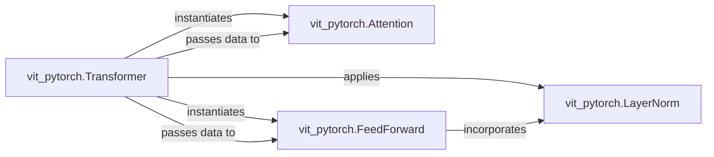

## Details

The `Core Transformer Layers` subsystem forms the fundamental, reusable building blocks of the transformer architecture within ViT models. It encapsulates the core neural network layers that process sequential data, enabling the model to learn complex representations.

### vit_pytorch.Transformer
A composite component that encapsulates a single block of the transformer architecture, orchestrating the `Attention` and `FeedForward` mechanisms. It represents a fundamental building block for stacking multiple transformer layers within a larger model.

**Related Classes/Methods**:

- <a href="https://github.com/lucidrains/vit-pytorch/blob/main/vit_pytorch/vit.py" target="_blank" rel="noopener noreferrer">`vit_pytorch.Transformer`</a>

### vit_pytorch.Attention
Implements the multi-head self-attention mechanism, a core neural network layer responsible for capturing dependencies across the input sequence by weighting different parts of the input. It is a fundamental reusable building block.

**Related Classes/Methods**:

- <a href="https://github.com/lucidrains/vit-pytorch/blob/main/vit_pytorch/vit.py" target="_blank" rel="noopener noreferrer">`vit_pytorch.Attention`</a>

### vit_pytorch.FeedForward
Applies a position-wise, two-layer fully connected neural network, essential for transforming attended features within a transformer block. This component provides the non-linearity and depth required for feature learning after the attention mechanism.

**Related Classes/Methods**:

- <a href="https://github.com/lucidrains/vit-pytorch/blob/main/vit_pytorch/vit.py" target="_blank" rel="noopener noreferrer">`vit_pytorch.FeedForward`</a>

### vit_pytorch.LayerNorm
Performs normalization of activations, serving as a crucial utility component that stabilizes training and improves performance within the transformer block by normalizing inputs to sub-layers.

**Related Classes/Methods**:

- <a href="https://github.com/lucidrains/vit-pytorch/blob/main/vit_pytorch/vit.py" target="_blank" rel="noopener noreferrer">`vit_pytorch.LayerNorm`</a>

### [FAQ](https://github.com/CodeBoarding/GeneratedOnBoardings/tree/main?tab=readme-ov-file#faq)