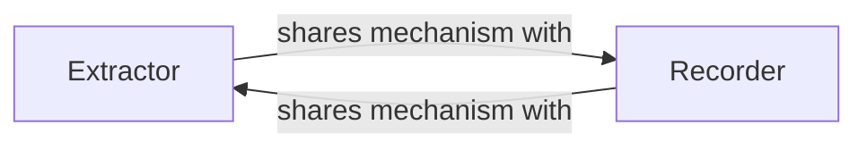

## Details

The Model Utilities & Hooks subsystem encompasses components designed to provide introspection, feature extraction, and activation monitoring capabilities for Vision Transformer (ViT) models. Its primary role is to facilitate debugging, analysis, and deeper understanding of the model's internal workings during inference or training.

### Extractor
This component is responsible for providing a mechanism to extract specific intermediate features or activations from designated layers or modules within a ViT model. It allows users to "peek inside" the model at a particular point during its forward pass, retrieving a snapshot of the internal state.

**Related Classes/Methods**:

- <a href="https://github.com/lucidrains/vit-pytorch/blob/main/vit_pytorch/extractor.py#L18-L90" target="_blank" rel="noopener noreferrer">`vit_pytorch.extractor.Extractor`:18-90</a>

### Recorder
This component is designed to record and store activations from specified modules within a ViT model over time. It offers a persistent way to monitor the flow of data and activations at various points, enabling post-hoc analysis of the model's behavior.

**Related Classes/Methods**:

- <a href="https://github.com/lucidrains/vit-pytorch/blob/main/vit_pytorch/recorder.py#L10-L59" target="_blank" rel="noopener noreferrer">`vit_pytorch.recorder.Recorder`:10-59</a>

### [FAQ](https://github.com/CodeBoarding/GeneratedOnBoardings/tree/main?tab=readme-ov-file#faq)