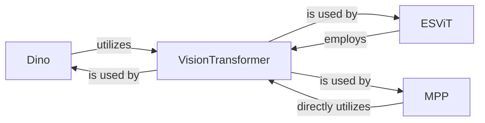

## Details

The `vit-pytorch` subsystem is structured around various self-supervised learning methodologies, all leveraging the `VisionTransformer` as a core component. The `VisionTransformer` functions as the foundational backbone, responsible for extracting features from input data. Building upon this, three distinct self-supervised learning frameworks—`Dino`, `ESViT`, and `MPP`—each integrate and utilize the `VisionTransformer` to achieve their specific learning objectives. `Dino` implements a self-distillation process, `ESViT` focuses on view-based and region-based loss computations, and `MPP` employs a masked patch prediction mechanism. This architecture highlights `VisionTransformer`'s role as a shared, essential representational component, specialized and trained by these higher-level self-supervised learning modules.

### Dino
Orchestrates the DINO self-distillation process. It manages the student and teacher Vision Transformer networks, applies momentum updates to the teacher's parameters, and computes the DINO loss based on contrastive learning principles.

**Related Classes/Methods**:

- <a href="https://github.com/lucidrains/vit-pytorch/blob/main/vit_pytorch/dino.py#L184-L303" target="_blank" rel="noopener noreferrer">`Dino`:184-303</a>

### ESViT
Manages the ESViT self-supervised learning process. This involves handling student and teacher networks, applying momentum updates to the teacher, and computing both view-based and region-based losses for efficient self-supervised learning.

**Related Classes/Methods**:

- <a href="https://github.com/lucidrains/vit-pytorch/blob/main/vit_pytorch/es_vit.py#L223-L367" target="_blank" rel="noopener noreferrer">`ESViT`:223-367</a>

### MPP
Implements the masked patch prediction mechanism. Its core function is to generate masks for input image patches and compute the masked patch prediction loss, enabling a reconstructive self-supervised objective.

**Related Classes/Methods**:

- <a href="https://github.com/lucidrains/vit-pytorch/blob/main/vit_pytorch/mpp.py#L79-L175" target="_blank" rel="noopener noreferrer">`MPP`:79-175</a>

### VisionTransformer
Serves as the core Vision Transformer (ViT) model, acting as a backbone for feature extraction. It is a foundational neural network architecture that is adapted and utilized by the various self-supervised learning frameworks.

**Related Classes/Methods**:

- <a href="https://github.com/lucidrains/vit-pytorch/blob/main/vit_pytorch/vit.py" target="_blank" rel="noopener noreferrer">`VisionTransformer`</a>

### [FAQ](https://github.com/CodeBoarding/GeneratedOnBoardings/tree/main?tab=readme-ov-file#faq)