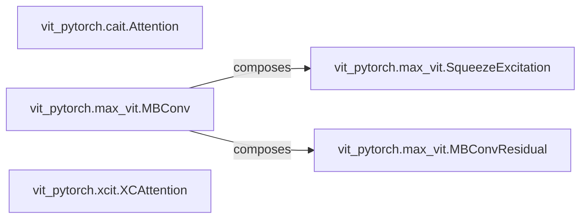

## Details

The `Specialized Neural Network Blocks` subsystem encompasses custom attention mechanisms, convolutional blocks, and unique layers that are integrated into specific Vision Transformer (ViT) architectures to enhance their performance or properties. Its boundaries are defined by the specialized implementations of core neural network operations found in various `vit-pytorch` model variants.

### vit_pytorch.cait.Attention
This component implements a specialized attention mechanism, specifically incorporating "talking heads" to mix attention heads before and after the softmax operation. It is crucial for the CaiT (Class-attention in Image Transformers) model, enhancing its ability to handle class-attention efficiently.

**Related Classes/Methods**:

- <a href="https://github.com/lucidrains/vit-pytorch/blob/main/vit_pytorch/cait.py#L61-L103" target="_blank" rel="noopener noreferrer">`vit_pytorch.cait.Attention`:61-103</a>

### vit_pytorch.max_vit.MBConv
This component is an efficient inverted residual block, a foundational convolutional building block adapted for the Max-ViT architecture. It performs feature expansion, depthwise convolution, and projection, contributing to efficient feature extraction and transformation within the Max-ViT model.

**Related Classes/Methods**:

- <a href="https://github.com/lucidrains/vit-pytorch/blob/main/vit_pytorch/max_vit.py#L90-L117" target="_blank" rel="noopener noreferrer">`vit_pytorch.max_vit.MBConv`:90-117</a>

### vit_pytorch.xcit.XCAttention
This component computes cross-covariance attention, an alternative attention mechanism designed for computational efficiency in the XCiT model. Unlike standard self-attention, it focuses on interactions between feature dimensions rather than spatial dimensions, leading to improved performance characteristics.

**Related Classes/Methods**:

- <a href="https://github.com/lucidrains/vit-pytorch/blob/main/vit_pytorch/xcit.py#L109-L148" target="_blank" rel="noopener noreferrer">`vit_pytorch.xcit.XCAttention`:109-148</a>

### vit_pytorch.max_vit.SqueezeExcitation
This component performs channel-wise feature recalibration. It adaptively re-calibrates channel-wise feature responses by explicitly modeling interdependencies between channels, enhancing the representational power of the network. It is a sub-component often integrated into convolutional blocks like `MBConv`.

**Related Classes/Methods**:

- <a href="https://github.com/lucidrains/vit-pytorch/blob/main/vit_pytorch/max_vit.py#L47-L62" target="_blank" rel="noopener noreferrer">`vit_pytorch.max_vit.SqueezeExcitation`:47-62</a>

### vit_pytorch.max_vit.MBConvResidual
This component manages residual connections within the `MBConv` block. It ensures that the input features are added back to the output of the convolutional path, facilitating gradient flow and enabling the training of deeper networks.

**Related Classes/Methods**:

- <a href="https://github.com/lucidrains/vit-pytorch/blob/main/vit_pytorch/max_vit.py#L65-L74" target="_blank" rel="noopener noreferrer">`vit_pytorch.max_vit.MBConvResidual`:65-74</a>

### [FAQ](https://github.com/CodeBoarding/GeneratedOnBoardings/tree/main?tab=readme-ov-file#faq)