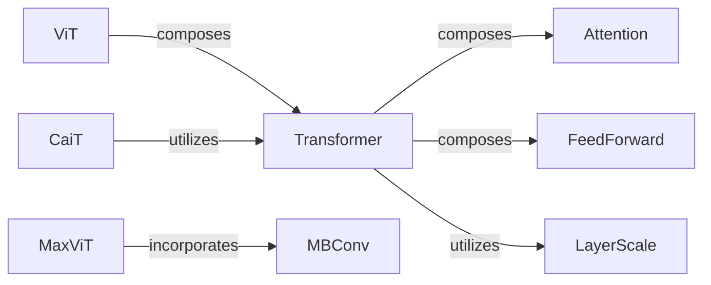

## Details

The `vit-pytorch` project implements various Vision Transformer (ViT) architectures, focusing on image processing through self-attention mechanisms. The core components include the `ViT` model, which processes image patches using `Transformer` blocks. `CaiT` is an enhanced variant that refines the `Transformer` usage for improved stability. `MaxViT` introduces a hybrid approach, combining `MBConv` blocks with attention for robust feature extraction. The `Transformer` component, central to these models, is composed of `Attention` and `FeedForward` layers, which handle sequence processing and non-linear transformations, respectively. `LayerScale` is a crucial mechanism utilized within the `Transformer` blocks to stabilize training, particularly in deeper models like `CaiT`.

### ViT
The foundational Vision Transformer model, serving as the base for image patch processing and sequence transformation. It is a primary model architecture.

**Related Classes/Methods**:

- <a href="https://github.com/lucidrains/vit-pytorch/blob/main/vit_pytorch/vit.py#L83-L127" target="_blank" rel="noopener noreferrer">`vit_pytorch.vit.ViT`:83-127</a>

### CaiT
An enhanced Vision Transformer variant that incorporates LayerScale for improved training stability and performance.

**Related Classes/Methods**:

- <a href="https://github.com/lucidrains/vit-pytorch/blob/main/vit_pytorch/cait.py#L124-L178" target="_blank" rel="noopener noreferrer">`vit_pytorch.cait.CaiT`:124-178</a>

### MaxViT
A hybrid convolutional-attention model that integrates MBConv blocks and applies Dropsample for regularization, offering a different approach to feature extraction.

**Related Classes/Methods**:

- <a href="https://github.com/lucidrains/vit-pytorch/blob/main/vit_pytorch/max_vit.py#L208-L291" target="_blank" rel="noopener noreferrer">`vit_pytorch.max_vit.MaxViT`:208-291</a>

### Transformer
A generic transformer block that stacks multiple Attention and FeedForward layers, forming the core sequence processing unit for various ViT models.

**Related Classes/Methods**:

- <a href="https://github.com/lucidrains/vit-pytorch/blob/main/vit_pytorch/vit.py" target="_blank" rel="noopener noreferrer">`vit_pytorch.vit.Transformer`</a>

### Attention
Computes self-attention across input tokens, enabling the model to capture long-range dependencies within the sequence.

**Related Classes/Methods**:

- <a href="https://github.com/lucidrains/vit-pytorch/blob/main/vit_pytorch/vit.py#L29-L63" target="_blank" rel="noopener noreferrer">`vit_pytorch.vit.Attention`:29-63</a>

### FeedForward
Applies non-linear transformations to token embeddings, enhancing their representational power after the attention mechanism.

**Related Classes/Methods**:

- <a href="https://github.com/lucidrains/vit-pytorch/blob/main/vit_pytorch/vit.py#L14-L27" target="_blank" rel="noopener noreferrer">`vit_pytorch.vit.FeedForward`:14-27</a>

### LayerScale
A mechanism used to scale layer outputs, primarily to stabilize training in deep neural networks, particularly within the CaiT architecture.

**Related Classes/Methods**:

- <a href="https://github.com/lucidrains/vit-pytorch/blob/main/vit_pytorch/cait.py#L31-L45" target="_blank" rel="noopener noreferrer">`vit_pytorch.cait.LayerScale`:31-45</a>

### MBConv
An efficient convolutional block, often including depthwise separable convolutions and squeeze-excitation, used for robust feature extraction in models like MaxViT.

**Related Classes/Methods**:

- <a href="https://github.com/lucidrains/vit-pytorch/blob/main/vit_pytorch/max_vit.py#L90-L117" target="_blank" rel="noopener noreferrer">`vit_pytorch.max_vit.MBConv`:90-117</a>

### [FAQ](https://github.com/CodeBoarding/GeneratedOnBoardings/tree/main?tab=readme-ov-file#faq)