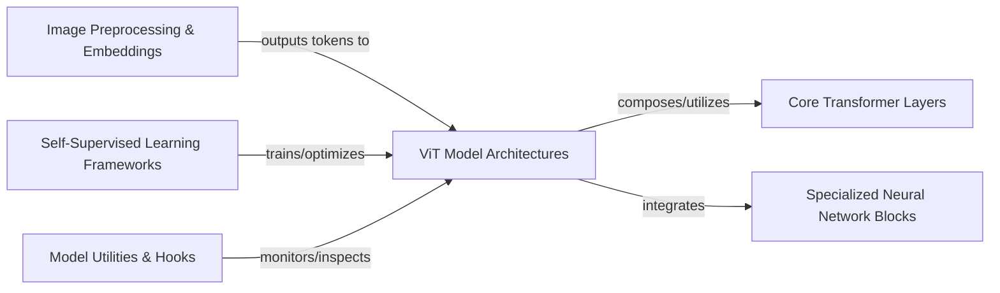

## Details

The `vit-pytorch` library is architecturally designed as a modular deep learning toolkit for Vision Transformer models.

### ViT Model Architectures [[Expand]](./ViT_Model_Architectures.md)
Encompasses the diverse range of Vision Transformer models, serving as the primary configurable models for image processing and feature extraction.

**Related Classes/Methods**:

- <a href="https://github.com/lucidrains/vit-pytorch/blob/main/vit_pytorch/vit.py#L83-L127" target="_blank" rel="noopener noreferrer">`vit_pytorch.vit.ViT`:83-127</a>
- <a href="https://github.com/lucidrains/vit-pytorch/blob/main/vit_pytorch/cait.py#L124-L178" target="_blank" rel="noopener noreferrer">`vit_pytorch.cait.CaiT`:124-178</a>
- <a href="https://github.com/lucidrains/vit-pytorch/blob/main/vit_pytorch/max_vit.py#L208-L291" target="_blank" rel="noopener noreferrer">`vit_pytorch.max_vit.MaxViT`:208-291</a>

### Image Preprocessing & Embeddings [[Expand]](./Image_Preprocessing_Embeddings.md)
Responsible for converting raw image data into a sequence of tokens and adding positional embeddings, preparing the input for transformer models.

**Related Classes/Methods**:

- <a href="https://github.com/lucidrains/vit-pytorch/blob/main/vit_pytorch/vit.py" target="_blank" rel="noopener noreferrer">`vit_pytorch.RearrangeImage`</a>
- <a href="https://github.com/lucidrains/vit-pytorch/blob/main/vit_pytorch/vit.py" target="_blank" rel="noopener noreferrer">`vit_pytorch.PatchEmbedding`</a>
- <a href="https://github.com/lucidrains/vit-pytorch/blob/main/vit_pytorch/simple_vit.py" target="_blank" rel="noopener noreferrer">`vit_pytorch.posemb_sincos_2d`</a>

### Core Transformer Layers [[Expand]](./Core_Transformer_Layers.md)
Fundamental, reusable building blocks (Attention, FeedForward, LayerNorm) that form the backbone of the transformer architecture within ViT models.

**Related Classes/Methods**:

- <a href="https://github.com/lucidrains/vit-pytorch/blob/main/vit_pytorch/vit.py" target="_blank" rel="noopener noreferrer">`vit_pytorch.Transformer`</a>
- <a href="https://github.com/lucidrains/vit-pytorch/blob/main/vit_pytorch/vit.py" target="_blank" rel="noopener noreferrer">`vit_pytorch.Attention`</a>
- <a href="https://github.com/lucidrains/vit-pytorch/blob/main/vit_pytorch/vit.py" target="_blank" rel="noopener noreferrer">`vit_pytorch.FeedForward`</a>

### Specialized Neural Network Blocks [[Expand]](./Specialized_Neural_Network_Blocks.md)
Custom attention mechanisms, convolutional blocks, and unique layers integrated into specific ViT architectures for enhanced performance or properties.

**Related Classes/Methods**:

- <a href="https://github.com/lucidrains/vit-pytorch/blob/main/vit_pytorch/cait.py#L61-L103" target="_blank" rel="noopener noreferrer">`vit_pytorch.cait.Attention`:61-103</a>
- <a href="https://github.com/lucidrains/vit-pytorch/blob/main/vit_pytorch/max_vit.py#L90-L117" target="_blank" rel="noopener noreferrer">`vit_pytorch.max_vit.MBConv`:90-117</a>
- <a href="https://github.com/lucidrains/vit-pytorch/blob/main/vit_pytorch/xcit.py#L109-L148" target="_blank" rel="noopener noreferrer">`vit_pytorch.xcit.XCAttention`:109-148</a>

### Self-Supervised Learning Frameworks [[Expand]](./Self_Supervised_Learning_Frameworks.md)
High-level frameworks (e.g., DINO, ESViT, MPP, MP3) for pre-training ViT models using unlabeled data, enabling robust representation learning.

**Related Classes/Methods**:

- <a href="https://github.com/lucidrains/vit-pytorch/blob/main/vit_pytorch/dino.py#L184-L303" target="_blank" rel="noopener noreferrer">`vit_pytorch.dino.Dino`:184-303</a>
- <a href="https://github.com/lucidrains/vit-pytorch/blob/main/vit_pytorch/es_vit.py#L223-L367" target="_blank" rel="noopener noreferrer">`vit_pytorch.es_vit.ESViT`:223-367</a>
- <a href="https://github.com/lucidrains/vit-pytorch/blob/main/vit_pytorch/mpp.py#L79-L175" target="_blank" rel="noopener noreferrer">`vit_pytorch.mpp.MPP`:79-175</a>

### Model Utilities & Hooks [[Expand]](./Model_Utilities_Hooks.md)
Provides tools for introspection, feature extraction, and monitoring activations within ViT models, aiding in debugging and analysis.

**Related Classes/Methods**:

- <a href="https://github.com/lucidrains/vit-pytorch/blob/main/vit_pytorch/extractor.py#L18-L90" target="_blank" rel="noopener noreferrer">`vit_pytorch.extractor.Extractor`:18-90</a>
- <a href="https://github.com/lucidrains/vit-pytorch/blob/main/vit_pytorch/recorder.py#L10-L59" target="_blank" rel="noopener noreferrer">`vit_pytorch.recorder.Recorder`:10-59</a>

### [FAQ](https://github.com/CodeBoarding/GeneratedOnBoardings/tree/main?tab=readme-ov-file#faq)