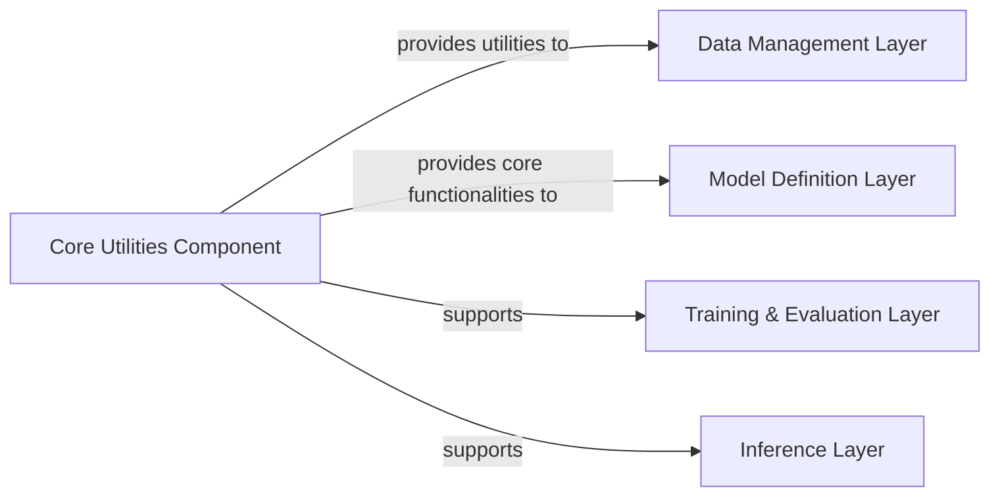

## Details

One paragraph explaining the functionality which is represented by this graph. What the main flow is and what is its purpose.

### Core Utilities Component [[Expand]](./Core_Utilities_Component.md)
This component provides foundational, shared functionalities and performance-critical operations utilized across all other components of the Text-to-Speech (TTS) system. It encompasses general utility functions, common data manipulations, and specialized modules for performance optimization, particularly in areas like monotonic alignment and custom text cleaning. Its design emphasizes reusability and efficiency, serving as a bedrock for various system operations.

**Related Classes/Methods**: _None_

### Data Management Layer
This layer is responsible for preparing input data, including functionalities from data_utils.py and preprocess.py.

**Related Classes/Methods**: _None_

### Model Definition Layer
This layer defines and operates the neural network architecture, including models.py, modules.py, attentions.py, losses.py, and mel_processing.py.

**Related Classes/Methods**: _None_

### Training & Evaluation Layer
This layer manages the training loop and optimization processes, including train.py and train_ms.py.

**Related Classes/Methods**: _None_

### Inference Layer
This layer handles generating speech from text inputs, including inferLJ.py and inference.ipynb.

**Related Classes/Methods**: _None_

### [FAQ](https://github.com/CodeBoarding/GeneratedOnBoardings/tree/main?tab=readme-ov-file#faq)