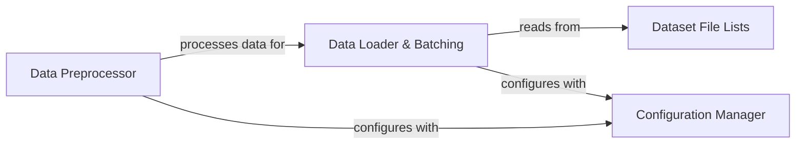

## Details

Abstract components overview for data handling in a project, including data loading, preprocessing, dataset file management, and configuration management. Concrete code references for 'Related Classes/Methods' are not available at this time.

### Data Loader & Batching
Manages the loading of raw data from specified paths, organizes it into batches, and prepares it for consumption by the model. It handles dataset iteration and potentially data augmentation.

**Related Classes/Methods**: _None_

### Data Preprocessor
Performs all necessary transformations on raw text and audio data, including text normalization, phonemization, and audio feature extraction (e.g., Mel spectrogram generation).

**Related Classes/Methods**: _None_

### Dataset File Lists
A collection of files (e.g., text files) that list the paths to raw audio and text data, serving as the primary index for the datasets.

**Related Classes/Methods**: _None_

### Configuration Manager
Stores and manages all data-related parameters, including dataset paths, preprocessing settings (e.g., sampling rates, Mel filter bank parameters), and feature extraction configurations.

**Related Classes/Methods**: _None_

### [FAQ](https://github.com/CodeBoarding/GeneratedOnBoardings/tree/main?tab=readme-ov-file#faq)