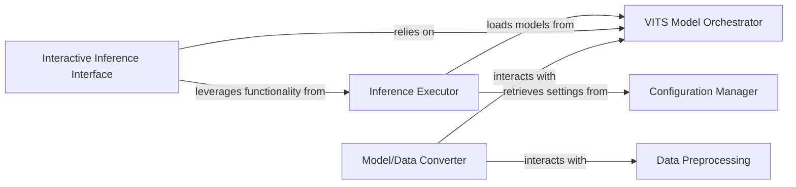

## Details

One paragraph explaining the functionality which is represented by this graph. What the main flow is and what is its purpose.

### Inference Executor
The core component responsible for programmatically executing the VITS model to generate speech from text inputs. It orchestrates the loading of the trained model and manages the inference process, retrieving necessary settings from the Configuration Manager.

**Related Classes/Methods**:

- <a href="https://github.com/YashSonkar-PhD-CSE/vits/blob/main/inferLJ.py#L1-L1" target="_blank" rel="noopener noreferrer">`inferLJ` (1:1)</a>
- <a href="https://github.com/YashSonkar-PhD-CSE/vits/blob/main/models.py#L1-L1" target="_blank" rel="noopener noreferrer">`models` (1:1)</a>
- <a href="https://github.com/YashSonkar-PhD-CSE/vits/blob/main/modules.py#L1-L1" target="_blank" rel="noopener noreferrer">`modules` (1:1)</a>
- `configs` (1:1)

### Interactive Inference Interface
Provides an interactive and user-friendly environment, typically a Jupyter notebook, for demonstrating, testing, and showcasing the VITS model's capabilities. It facilitates quick experimentation with different text inputs and model configurations, relying on the VITS Model Orchestrator for model access.

**Related Classes/Methods**:

- `inference` (1:1)

### Model/Data Converter
Handles the conversion of model formats or data formats, which may be necessary for deployment, compatibility with different inference frameworks, or specific data preparation steps required before inference. It interacts with the VITS Model Orchestrator for model-related conversions and with Data Preprocessing for data preparation.

**Related Classes/Methods**:

- `convert`
- <a href="https://github.com/YashSonkar-PhD-CSE/vits/blob/main/preprocess.py#L1-L1" target="_blank" rel="noopener noreferrer">`preprocess` (1:1)</a>
- <a href="https://github.com/YashSonkar-PhD-CSE/vits/blob/main/data_utils.py#L1-L1" target="_blank" rel="noopener noreferrer">`data_utils` (1:1)</a>

### VITS Model Orchestrator
Manages the lifecycle and access to the VITS models. It is responsible for loading, storing, and providing trained VITS models to other components like the Inference Executor and Interactive Inference Interface. It also facilitates interactions for model format conversions.

**Related Classes/Methods**: _None_

### Configuration Manager
Centralizes and provides configuration settings for various components within the system. It ensures that components like the Inference Executor can retrieve necessary parameters and settings consistently.

**Related Classes/Methods**: _None_

### Data Preprocessing
Handles the preparation and transformation of raw input data into a format suitable for the VITS model. This includes tasks such as text normalization, tokenization, and any other data-specific transformations required before inference or model training.

**Related Classes/Methods**: _None_

### [FAQ](https://github.com/CodeBoarding/GeneratedOnBoardings/tree/main?tab=readme-ov-file#faq)