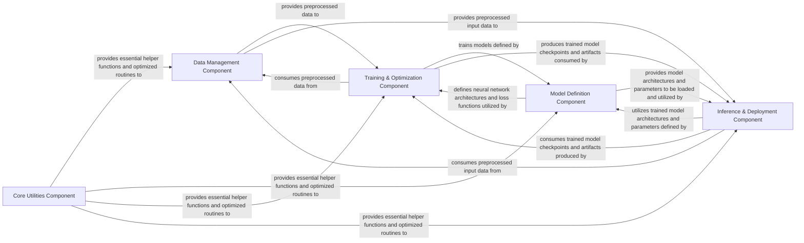

## Details

One paragraph explaining the functionality which is represented by this graph. What the main flow is and what is its purpose.

### Data Management Component [[Expand]](./Data_Management_Component.md)
Orchestrates the entire data pipeline, from raw data handling to feature extraction, ensuring data is in the correct format for model consumption. It manages dataset loading, text normalization, phonemization, and audio feature extraction.

**Related Classes/Methods**: _None_

### Model Definition Component
Encapsulates the core neural network architecture of the VITS model. It defines the main model structure, reusable network blocks, attention mechanisms, and the specific loss functions required for training.

**Related Classes/Methods**: _None_

### Training & Optimization Component
Manages the entire training lifecycle of the VITS model. This includes orchestrating data flow from the Data Management component, performing forward and backward passes through the Model Definition, optimizing model parameters, and handling logging and checkpointing.

**Related Classes/Methods**: _None_

### Inference & Deployment Component [[Expand]](./Inference_Deployment_Component.md)
Handles the generation of speech from text using a trained VITS model. It loads pre-trained models and provides interfaces for generating audio, including interactive demonstrations and potential model format conversions.

**Related Classes/Methods**: _None_

### Core Utilities Component [[Expand]](./Core_Utilities_Component.md)
Provides foundational, shared functionalities and performance-critical operations utilized across all other components. This includes general utility functions, common data manipulations, and specialized modules for performance optimization.

**Related Classes/Methods**: _None_

### [FAQ](https://github.com/CodeBoarding/GeneratedOnBoardings/tree/main?tab=readme-ov-file#faq)