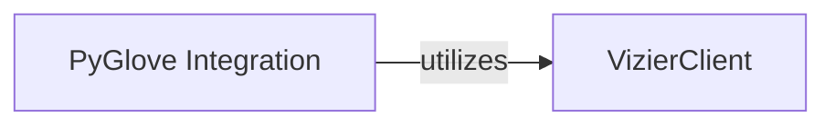

## Details

One paragraph explaining the functionality which is represented by this graph. What the main flow is and what is its purpose.

### VizierClient
This component provides the fundamental, general-purpose programmatic interface for direct client-server communication with the Vizier service. It is the main entry point for users and external systems to perform core operations like creating studies, submitting trials, and retrieving results. It handles the low-level communication protocols with the Vizier backend.

**Related Classes/Methods**:

- <a href="https://github.com/google/vizier/blob/main/vizier/_src/service/vizier_client.py#L93-L414" target="_blank" rel="noopener noreferrer">`vizier._src.service.vizier_client.VizierClient`:93-414</a>

### PyGlove Integration
This component offers a specialized, high-level API tailored specifically for PyGlove users and integrations. It abstracts the underlying Vizier interactions, providing a PyGlove-idiomatic way to define studies, submit trials, and retrieve results. It is responsible for data conversion between PyGlove's internal representations and Vizier's data structures.

**Related Classes/Methods**:

- <a href="https://github.com/google/vizier/blob/main/vizier/_src/pyglove/client.py" target="_blank" rel="noopener noreferrer">`vizier._src.pyglove.client.VizierClient`</a>

### [FAQ](https://github.com/CodeBoarding/GeneratedOnBoardings/tree/main?tab=readme-ov-file#faq)