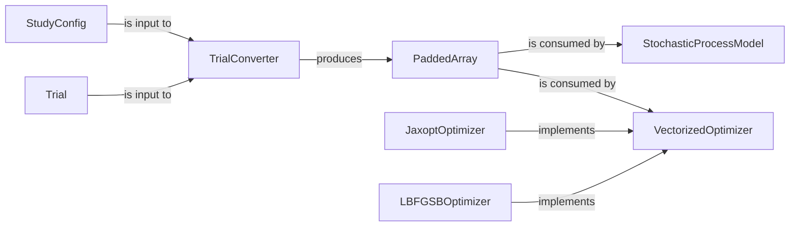

## Details

The Vizier JAX optimization subsystem is a specialized part of the Vizier project designed for efficient hyperparameter tuning and black-box optimization leveraging JAX. It operates by first converting high-level `Trial` and `StudyConfig` data into a standardized `PaddedArray` format through the `TrialConverter`, enabling seamless integration with JAX's numerical capabilities. The core of the optimization process is defined by the `VectorizedOptimizer`, an abstract component that outlines a vectorized "ask-evaluate-tell" optimization loop. This abstract interface is concretely implemented by various optimizers, including the `LBFGSBOptimizer` for specific algorithms and the `JaxoptOptimizer` for integrating external JAXopt routines. Furthermore, the `StochasticProcessModel` provides a framework for building and utilizing probabilistic models, often serving as surrogate models to enhance the efficiency and effectiveness of the optimization process by predicting objective values and their uncertainties. This modular architecture ensures a clear separation of concerns, facilitating maintainability and extensibility within the optimization pipeline.

### Trial
Represents a single experiment or evaluation within an optimization study. It encapsulates the input parameters used for a specific run and the observed objective metrics resulting from that run. It is the atomic unit of data that optimization algorithms process and generate.

**Related Classes/Methods**:

### StudyConfig
Defines the overall optimization problem, including the search space (parameters and their constraints), objective metrics (what to optimize), and other global settings for an optimization study. It acts as the blueprint for an optimization run.

**Related Classes/Methods**:

### TrialConverter
A critical utility responsible for converting Vizier's native, human-readable data structures (`Trial` and `StudyConfig`) into numerical arrays (specifically `PaddedArray`) that can be efficiently processed by JAX-based algorithms. It also handles the reverse conversion.

**Related Classes/Methods**:

### PaddedArray
A JAX-specific data structure designed for efficient handling of variable-length arrays through padding. It stores the `padded_array` (the JAX array with padding), `fill_value`, `_original_shape` (the shape before padding), and a `_mask` to distinguish original data from padded values. It provides factory methods like `from_array` for consistent creation and an `unpad` method to retrieve the original array. This is essential for batch processing and vectorized operations in JAX-based numerical computations, particularly when dealing with diverse parameter types or trial data.

**Related Classes/Methods**:

- <a href="https://github.com/google/vizier/blob/main/vizier/_src/jax/types.py#L40-L146" target="_blank" rel="noopener noreferrer">`vizier._src.jax.types.PaddedArray`:40-146</a>

### VectorizedOptimizer
A foundational abstract class for implementing vectorized optimization strategies. It defines the common interface and orchestrates the "ask-evaluate-tell" optimization loop. It takes a `strategy` (a factory for generating new strategies), `n_feature_dimensions`, `n_feature_dimensions_with_padding`, `suggestion_batch_size`, and `max_evaluations`. It processes numerical inputs (implicitly `PaddedArray` data) and returns `VectorizedStrategyResults` containing optimized features and rewards.

**Related Classes/Methods**:

- <a href="https://github.com/google/vizier/blob/main/vizier/_src/algorithms/optimizers/vectorized_base.py#L278-L587" target="_blank" rel="noopener noreferrer">`vizier._src.algorithms.optimizers.vectorized_base.VectorizedOptimizer`:278-587</a>

### JaxoptOptimizer
An adapter that integrates external JAXopt optimizers into Vizier's framework. It provides a consistent interface for various numerical optimization routines available in the JAXopt library, allowing them to be used seamlessly within Vizier's optimization pipeline.

**Related Classes/Methods**:

### LBFGSBOptimizer
A concrete implementation of the L-BFGS-B algorithm, a popular numerical optimization method particularly suited for bound-constrained continuous problems. Its `__post_init__` method explicitly raises an error if categorical features are present, indicating its specialization for continuous optimization. It consumes numerical inputs (implicitly `PaddedArray` data) and produces `VectorizedStrategyResults`.

**Related Classes/Methods**:

- <a href="https://github.com/google/vizier/blob/main/vizier/_src/algorithms/optimizers/lbfgsb_optimizer.py#L46-L178" target="_blank" rel="noopener noreferrer">`vizier._src.algorithms.optimizers.lbfgsb_optimizer.LBFGSBOptimizer`:46-178</a>

### StochasticProcessModel
A general JAX-based framework for defining, initializing, and training various stochastic process models. It provides a reusable structure for probabilistic modeling, often used as surrogate models in Bayesian Optimization to predict objective values and their uncertainties.

**Related Classes/Methods**:

### [FAQ](https://github.com/CodeBoarding/GeneratedOnBoardings/tree/main?tab=readme-ov-file#faq)