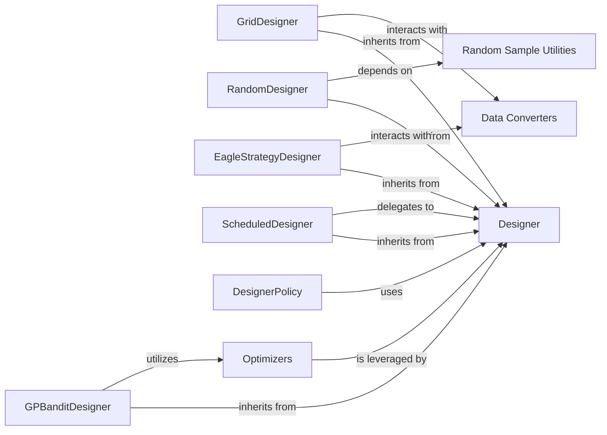

## Details

The Vizier `algorithms` subsystem is centered around the abstract `Designer` interface, which defines the core contract for hyperparameter optimization algorithms. Various concrete `Designer` implementations, such as `GPBanditDesigner`, `GridDesigner`, `RandomDesigner`, `EagleStrategyDesigner`, and `ScheduledDesigner`, extend this interface to provide specific optimization strategies. The `DesignerPolicy` acts as an orchestrator, managing and interacting with these `Designer` instances to expose optimization capabilities to the broader Vizier system. Several designers, particularly `GPBanditDesigner`, leverage internal `Optimizers` for sub-problems within their algorithms. Additionally, `GridDesigner` and `EagleStrategyDesigner` interact with `Data Converters` for necessary data transformations, while `RandomDesigner` depends on `Random Sample Utilities` for generating random suggestions. This modular design allows for flexible integration of diverse optimization techniques.

### Designer
The foundational abstract interface that all specific hyperparameter optimization and black-box optimization algorithms must implement. It defines the core contract for generating new parameter suggestions (`suggest`) and incorporating completed trial results (`update`).

**Related Classes/Methods**:

- <a href="https://github.com/google/vizier/blob/main/vizier/_src/algorithms/core/abstractions.py#L92-L148" target="_blank" rel="noopener noreferrer">`vizier._src.algorithms.core.abstractions.Designer`:92-148</a>

### GPBanditDesigner
A concrete implementation of the `Designer` interface that utilizes Gaussian Process-based Bayesian Optimization. It models the objective function and proposes new trials by maximizing an acquisition function.

**Related Classes/Methods**:

### GridDesigner
A concrete implementation of the `Designer` interface that performs a systematic grid search. It generates suggestions by exhaustively exploring a predefined grid within the parameter space.

**Related Classes/Methods**:

### RandomDesigner
A concrete implementation of the `Designer` interface that performs random search. It generates new parameter suggestions by sampling randomly from the defined search space.

**Related Classes/Methods**:

- <a href="https://github.com/google/vizier/blob/main/vizier/_src/algorithms/designers/random.py#L27-L99" target="_blank" rel="noopener noreferrer">`vizier._src.algorithms.designers.random.RandomDesigner`:27-99</a>

### EagleStrategyDesigner
A concrete implementation of the `Designer` interface based on the Eagle Strategy, an evolutionary optimization algorithm. It generates suggestions by evolving a population of candidate solutions.

**Related Classes/Methods**:

- <a href="https://github.com/google/vizier/blob/main/vizier/_src/algorithms/designers/eagle_strategy/eagle_strategy.py#L95-L464" target="_blank" rel="noopener noreferrer">`vizier._src.algorithms.designers.eagle_strategy.eagle_strategy.EagleStrategyDesigner`:95-464</a>

### ScheduledDesigner
A concrete implementation of the `Designer` interface that acts as an orchestrator. It delegates its `suggest` and `update` calls to other `Designer` instances based on a predefined schedule or policy, enabling multi-stage or adaptive optimization.

**Related Classes/Methods**:

- <a href="https://github.com/google/vizier/blob/main/vizier/_src/algorithms/designers/scheduled_designer.py#L118-L253" target="_blank" rel="noopener noreferrer">`vizier._src.algorithms.designers.scheduled_designer.ScheduledDesigner`:118-253</a>

### DesignerPolicy
Acts as a standardized interface or manager for interacting with `Designer` instances. It exposes the optimization algorithms to the broader Vizier system, potentially handling their selection, configuration, and orchestration.

**Related Classes/Methods**:

- <a href="https://github.com/google/vizier/blob/main/vizier/_src/algorithms/policies/designer_policy.py#L40-L123" target="_blank" rel="noopener noreferrer">`vizier._src.algorithms.policies.designer_policy.DesignerPolicy`:40-123</a>

### Optimizers
Provides internal optimization routines that are utilized by various designers. These routines are typically used for sub-problems within a larger optimization algorithm, such as maximizing acquisition functions in Bayesian Optimization.

**Related Classes/Methods**:

- <a href="https://github.com/google/vizier/blob/main/vizier/_src/algorithms/optimizers/__init__.py" target="_blank" rel="noopener noreferrer">`vizier._src.algorithms.optimizers`</a>

### Data Converters
This component represents the `vizier.pyvizier.converters` package, which is responsible for transforming data between different formats or representations within the Vizier system. This is crucial for designers that might operate on specific data structures or require input/output in a particular format.

**Related Classes/Methods**:

- <a href="https://github.com/google/vizier/blob/main/vizier/pyvizier/converters/__init__.py" target="_blank" rel="noopener noreferrer">`vizier.pyvizier.converters`</a>

### Random Sample Utilities
This component represents the `vizier._src.algorithms.random.random_sample` module, which provides functionalities for generating random samples. This is directly utilized by designers that employ random search strategies.

**Related Classes/Methods**:

- <a href="https://github.com/google/vizier/blob/main/vizier/_src/algorithms/random/random_sample.py" target="_blank" rel="noopener noreferrer">`vizier._src.algorithms.random.random_sample`</a>

### [FAQ](https://github.com/CodeBoarding/GeneratedOnBoardings/tree/main?tab=readme-ov-file#faq)