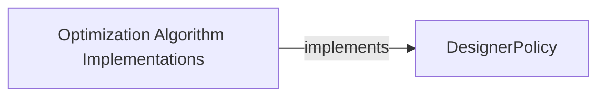

## Details

Corrected relationship between DesignerPolicy and Optimization Algorithm Implementations.

### DesignerPolicy
An abstract interface or base class defining the contract for a policy designer.

**Related Classes/Methods**: _None_

### Optimization Algorithm Implementations
Concrete implementations of optimization algorithms that fulfill the DesignerPolicy contract.

**Related Classes/Methods**: _None_

### [FAQ](https://github.com/CodeBoarding/GeneratedOnBoardings/tree/main?tab=readme-ov-file#faq)