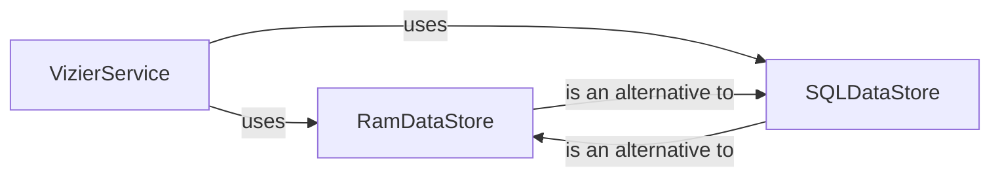

## Details

The Vizier Service Core subsystem encompasses the central backend logic for managing optimization studies and trials, including their lifecycle, orchestration, and data persistence. It primarily consists of the VizierService and its associated data storage mechanisms, RamDataStore and SQLDataStore.

### VizierService
The core orchestrator of the Vizier system. It manages the complete lifecycle of optimization studies and trials, handling operations such as creation, completion, deletion, and stopping of trials, adding measurements, and managing metadata. It interacts with external algorithmic services for trial suggestions and enforces study immutability rules. This component is central due to its role in coordinating all study-related operations.

**Related Classes/Methods**:

- <a href="https://github.com/google/vizier/blob/main/vizier/_src/service/types.py" target="_blank" rel="noopener noreferrer">`VizierService`</a>

### RamDataStore
Provides an in-memory, non-persistent data storage solution for Vizier studies, trials, and suggestion operations. It's designed for scenarios where data persistence is not required, such as rapid prototyping or testing environments. Its architectural importance lies in offering a lightweight, fast storage option.

**Related Classes/Methods**:

- <a href="https://github.com/google/vizier/blob/main/vizier/_src/service/ram_datastore.py#L83-L475" target="_blank" rel="noopener noreferrer">`RamDataStore`:83-475</a>

### SQLDataStore
Offers a robust, persistent, SQL-based data storage solution for all Vizier entities, including studies, trials, suggestion operations, early stopping operations, and metadata. It ensures data integrity through transactional operations, making it suitable for critical and long-running optimization studies. This component is crucial for the reliability and durability of the Vizier service.

**Related Classes/Methods**:

- <a href="https://github.com/google/vizier/blob/main/vizier/_src/service/sql_datastore.py#L40-L630" target="_blank" rel="noopener noreferrer">`SQLDataStore`:40-630</a>

### [FAQ](https://github.com/CodeBoarding/GeneratedOnBoardings/tree/main?tab=readme-ov-file#faq)