```mermaid
graph LR
    Client_API["Client API"]
    Vizier_Service_Core["Vizier Service Core"]
    Pythia_Policy_Service["Pythia Policy Service"]
    Optimization_Algorithms_Designers_["Optimization Algorithms (Designers)"]
    Data_Numerical_Utilities["Data & Numerical Utilities"]
    Client_API -- "Requests Study/Trial Operations" --> Vizier_Service_Core
    Vizier_Service_Core -- "Provides Optimization Results" --> Client_API
    Vizier_Service_Core -- "Utilizes Data Structures for Persistence" --> Data_Numerical_Utilities
    Vizier_Service_Core -- "Requests Suggestions" --> Pythia_Policy_Service
    Pythia_Policy_Service -- "Delegates Suggestion Generation" --> Optimization_Algorithms_Designers_
    Optimization_Algorithms_Designers_ -- "Processes/Generates Trial Data" --> Data_Numerical_Utilities
    Optimization_Algorithms_Designers_ -- "Leverages Numerical Computations" --> Data_Numerical_Utilities
    click Client_API href "https://github.com/CodeBoarding/GeneratedOnBoardings/blob/main/vizier/Client_API.md" "Details"
    click Vizier_Service_Core href "https://github.com/CodeBoarding/GeneratedOnBoardings/blob/main/vizier/Vizier_Service_Core.md" "Details"
    click Pythia_Policy_Service href "https://github.com/CodeBoarding/GeneratedOnBoardings/blob/main/vizier/Pythia_Policy_Service.md" "Details"
    click Optimization_Algorithms_Designers_ href "https://github.com/CodeBoarding/GeneratedOnBoardings/blob/main/vizier/Optimization_Algorithms_Designers_.md" "Details"
    click Data_Numerical_Utilities href "https://github.com/CodeBoarding/GeneratedOnBoardings/blob/main/vizier/Data_Numerical_Utilities.md" "Details"
```

## Details

The Vizier project is structured around a core service that orchestrates hyperparameter optimization studies, supported by a flexible policy engine and various optimization algorithms. The Client API serves as the primary entry point for users and integrated systems, allowing them to define studies, submit trials, and retrieve results. This API communicates directly with the Vizier Service Core, which acts as the central backend. The Service Core manages the entire lifecycle of studies and trials, handling their persistence and overall flow. For generating new trial suggestions, the Vizier Service Core delegates requests to the Pythia Policy Service. This service, in turn, dispatches these requests to various Optimization Algorithms (Designers). These designers, such as GP Bandit and Grid Search, are responsible for generating new parameter suggestions based on the current state of the optimization study. Both the Vizier Service Core and the Optimization Algorithms heavily rely on the Data & Numerical Utilities component. This utility layer provides fundamental data structures for representing core optimization concepts like trials and study configurations, and offers efficient numerical computation backends (e.g., JAX-based optimizers) that the algorithms leverage for their computations.

### Client API [[Expand]](./Client_API.md)
The primary interface for users and integrated systems (like PyGlove) to interact with Vizier, enabling study definition, trial submission, and result retrieval.

**Related Classes/Methods**:

- <a href="https://github.com/google/vizier/blob/main/vizier/_src/service/vizier_client.py#L93-L414" target="_blank" rel="noopener noreferrer">`VizierClient`:93-414</a>
- <a href="https://github.com/google/vizier/blob/main/vizier/_src/pyglove/core.py#L1-L100" target="_blank" rel="noopener noreferrer">`PyGlove integration`:1-100</a>

### Vizier Service Core [[Expand]](./Vizier_Service_Core.md)
The central backend service responsible for managing the lifecycle of optimization studies and trials, orchestrating the overall flow, and handling data persistence.

**Related Classes/Methods**:

- <a href="https://github.com/google/vizier/blob/main/vizier/_src/service/types.py" target="_blank" rel="noopener noreferrer">`VizierService`</a>
- <a href="https://github.com/google/vizier/blob/main/vizier/_src/service/ram_datastore.py#L83-L475" target="_blank" rel="noopener noreferrer">`RamDataStore`:83-475</a>
- <a href="https://github.com/google/vizier/blob/main/vizier/_src/service/sql_datastore.py#L40-L630" target="_blank" rel="noopener noreferrer">`SQLDataStore`:40-630</a>

### Pythia Policy Service [[Expand]](./Pythia_Policy_Service.md)
A dedicated service acting as the core suggestion engine, responsible for receiving requests for new trials and delegating the actual suggestion generation to specific Optimization Algorithms (Designers).

**Related Classes/Methods**:

- <a href="https://github.com/google/vizier/blob/main/vizier/_src/pythia/local_policy_supporters.py#L1-L100" target="_blank" rel="noopener noreferrer">`LocalPolicySupporter`:1-100</a>

### Optimization Algorithms (Designers) [[Expand]](./Optimization_Algorithms_Designers_.md)
A pluggable component containing various hyperparameter optimization and black-box optimization algorithms (e.g., GP bandits, grid search, evolutionary strategies) that generate new parameter suggestions.

**Related Classes/Methods**:

- <a href="https://github.com/google/vizier/blob/main/vizier/_src/algorithms/core/abstractions.py#L92-L148" target="_blank" rel="noopener noreferrer">`Designer`:92-148</a>
- <a href="https://github.com/google/vizier/blob/main/vizier/_src/algorithms/designers/gp_bandit.py#L1-L100" target="_blank" rel="noopener noreferrer">`GP Bandit`:1-100</a>
- <a href="https://github.com/google/vizier/blob/main/vizier/_src/algorithms/designers/grid.py#L1-L100" target="_blank" rel="noopener noreferrer">`GridDesigner`:1-100</a>

### Data & Numerical Utilities [[Expand]](./Data_Numerical_Utilities.md)
Provides fundamental data structures for representing optimization concepts (search spaces, parameters, trials, metrics) and offers efficient numerical computation backends (JAX, various optimizers) utilized by the algorithms.

**Related Classes/Methods**:

- <a href="https://github.com/google/vizier/blob/main/demos/run_vizier_client.py#L84-L92" target="_blank" rel="noopener noreferrer">`Trial`:84-92</a>
- <a href="https://github.com/google/vizier/blob/main/vizier/_src/pythia/local_policy_supporters.py#L95-L103" target="_blank" rel="noopener noreferrer">`StudyConfig`:95-103</a>
- <a href="https://github.com/google/vizier/blob/main/vizier/_src/jax/optimizers/jaxopt_wrappers.py#L1-L100" target="_blank" rel="noopener noreferrer">`JaxoptOptimizer`:1-100</a>
- <a href="https://github.com/google/vizier/blob/main/vizier/_src/algorithms/optimizers/lbfgsb_optimizer.py#L46-L178" target="_blank" rel="noopener noreferrer">`LBFGSBOptimizer`:46-178</a>

### [FAQ](https://github.com/CodeBoarding/GeneratedOnBoardings/tree/main?tab=readme-ov-file#faq)