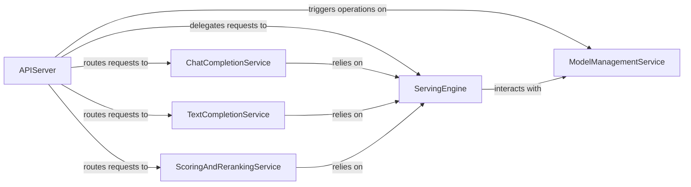

## Details

The `API Server` subsystem is primarily defined by the `vllm.entrypoints.openai.api_server` module. It encompasses the external interface of VLLM, responsible for handling incoming inference requests (e.g., via HTTP/OpenAI API) and formatting responses.

### APIServer
Initializes the asynchronous LLM engine client, sets up FastAPI routes for various endpoints (chat, completion, embedding, scoring, etc.), and orchestrates the overall request/response lifecycle, including LoRA management and streaming. It acts as the API Gateway.

**Related Classes/Methods**:

- <a href="https://github.com/vllm-project/vllm/blob/main/vllm/entrypoints/openai/api_server.py" target="_blank" rel="noopener noreferrer">`vllm.entrypoints.openai.api_server`</a>

### ServingEngine
Provides foundational logic for preprocessing incoming requests before they reach the core LLM engine. This includes validating requests, tokenizing prompts, handling multimodal data, batching requests for efficiency, and generating standardized error responses.

**Related Classes/Methods**:

- <a href="https://github.com/vllm-project/vllm/blob/main/vllm/entrypoints/openai/serving_engine.py" target="_blank" rel="noopener noreferrer">`vllm.entrypoints.openai.serving_engine`</a>

### ChatCompletionService
Specializes in processing and generating responses for OpenAI-compatible chat completion requests. It handles both streaming and non-streaming outputs, extracts tool calls, and formats chat log probabilities.

**Related Classes/Methods**:

- <a href="https://github.com/vllm-project/vllm/blob/main/vllm/entrypoints/openai/serving_chat.py" target="_blank" rel="noopener noreferrer">`vllm.entrypoints.openai.serving_chat`</a>

### TextCompletionService
Manages the generation of responses for OpenAI-compatible text completion requests. It converts raw outputs from the LLM engine into the expected OpenAI completion response format for both streaming and non-streaming scenarios.

**Related Classes/Methods**:

- <a href="https://github.com/vllm-project/vllm/blob/main/vllm/entrypoints/openai/serving_completion.py" target="_blank" rel="noopener noreferrer">`vllm.entrypoints.openai.serving_completion`</a>

### ModelManagementService
Handles the dynamic loading, unloading, and pinning of LoRA (Low-Rank Adaptation) adapters. It validates LoRA requests and interacts with the underlying LLM engine client to perform these operations.

**Related Classes/Methods**:

- <a href="https://github.com/vllm-project/vllm/blob/main/vllm/entrypoints/openai/serving_models.py" target="_blank" rel="noopener noreferrer">`vllm.entrypoints.openai.serving_models`</a>

### ScoringAndRerankingService
Processes requests for scoring and reranking, which typically involve evaluating text pairs or documents for relevance or similarity. It converts the model's raw outputs into appropriate score or rerank response formats.

**Related Classes/Methods**:

- <a href="https://github.com/vllm-project/vllm/blob/main/vllm/entrypoints/openai/serving_score.py" target="_blank" rel="noopener noreferrer">`vllm.entrypoints.openai.serving_score`</a>

### [FAQ](https://github.com/CodeBoarding/GeneratedOnBoardings/tree/main?tab=readme-ov-file#faq)