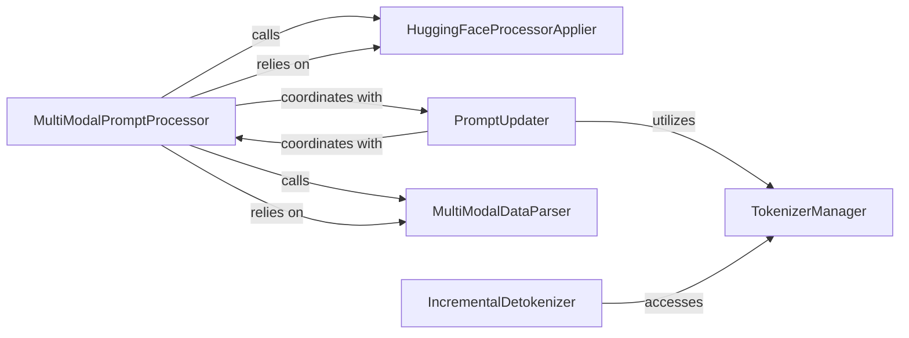

## Details

The `vllm.multimodal` subsystem is designed to efficiently process diverse multimodal inputs for large language models. At its core, the `MultiModalPromptProcessor` orchestrates the entire pipeline, initiating the parsing of raw multimodal data via the `MultiModalDataParser` and applying specialized processing through the `HuggingFaceProcessorApplier`. The `PromptUpdater` then refines the prompt, often utilizing the `TokenizerManager` for tokenization tasks. For output generation, the `IncrementalDetokenizer` works with the `TokenizerManager` to convert token IDs back into human-readable text, supporting streaming capabilities. This architecture ensures a streamlined flow from raw multimodal input to model-ready prompts and human-readable outputs.

### MultiModalPromptProcessor
Acts as the orchestrator for the entire multimodal input processing pipeline. It coordinates the steps required to convert diverse raw inputs (text, images, etc.) into a format suitable for the LLM.

**Related Classes/Methods**:

- <a href="https://github.com/vllm-project/vllm/blob/main/vllm/multimodal/processing.py" target="_blank" rel="noopener noreferrer">`vllm.multimodal.processing.MultiModalPromptProcessor`</a>

### TokenizerManager
Provides a unified and cached interface for retrieving and managing tokenizer instances (e.g., from Hugging Face Transformers). It is critical for both converting text inputs into token IDs and converting generated token IDs back into human-readable text.

**Related Classes/Methods**:

- <a href="https://github.com/vllm-project/vllm/blob/main/vllm/transformers_utils/tokenizer.py" target="_blank" rel="noopener noreferrer">`vllm.transformers_utils.tokenizer.TokenizerManager`</a>

### HuggingFaceProcessorApplier
Applies Hugging Face's pre-trained multimodal processors (e.g., for image feature extraction) to raw multimodal data. It incorporates caching to optimize performance by avoiding redundant computations.

**Related Classes/Methods**:

- <a href="https://github.com/vllm-project/vllm/blob/main/vllm/multimodal/processing.py" target="_blank" rel="noopener noreferrer">`vllm.multimodal.processing.HuggingFaceProcessorApplier`</a>

### PromptUpdater
Modifies the prompt (both text and token IDs) by identifying and replacing multimodal placeholders, applying chat templates, or performing other necessary transformations to align with the model's expected input format.

**Related Classes/Methods**:

- <a href="https://github.com/vllm-project/vllm/blob/main/vllm/multimodal/processing.py" target="_blank" rel="noopener noreferrer">`vllm.multimodal.processing.PromptUpdater`</a>

### MultiModalDataParser
Parses raw multimodal input data (e.g., base64 encoded strings for images) into a structured internal representation (`MultiModalDataItems`). This component ensures that diverse raw inputs are standardized for further processing.

**Related Classes/Methods**:

- <a href="https://github.com/vllm-project/vllm/blob/main/vllm/multimodal/parse.py#L314-L499" target="_blank" rel="noopener noreferrer">`vllm.multimodal.parse.MultiModalDataParser`:314-499</a>

### IncrementalDetokenizer
Converts a sequence of generated token IDs from the LLM back into a human-readable string. This component is crucial for supporting streaming outputs, where tokens are generated and detokenized incrementally.

**Related Classes/Methods**:

- <a href="https://github.com/vllm-project/vllm/blob/main/vllm/transformers_utils/detokenizer_utils.py" target="_blank" rel="noopener noreferrer">`vllm.transformers_utils.detokenizer_utils.IncrementalDetokenizer`</a>

### [FAQ](https://github.com/CodeBoarding/GeneratedOnBoardings/tree/main?tab=readme-ov-file#faq)