```mermaid
graph LR
    KV_Cache_Manager_BlockManager_["KV Cache Manager (BlockManager)"]
    Block_Table["Block Table"]
    Naive_Block_Allocator["Naive Block Allocator"]
    Prefix_Caching_Block_Allocator["Prefix Caching Block Allocator"]
    Evictor["Evictor"]
    Cache_Engine["Cache Engine"]
    Scheduler["Scheduler"]
    KVCacheUtils["KVCacheUtils"]
    Scheduler -- "requests operations from" --> KV_Cache_Manager_BlockManager_
    KV_Cache_Manager_BlockManager_ -- "delegates requests to" --> Naive_Block_Allocator
    KV_Cache_Manager_BlockManager_ -- "delegates requests to" --> Prefix_Caching_Block_Allocator
    KV_Cache_Manager_BlockManager_ -- "uses and updates" --> Block_Table
    KV_Cache_Manager_BlockManager_ -- "interacts with" --> Evictor
    Naive_Block_Allocator -- "requests memory from" --> Cache_Engine
    Prefix_Caching_Block_Allocator -- "requests memory from" --> Cache_Engine
    Prefix_Caching_Block_Allocator -- "uses" --> KVCacheUtils
    Prefix_Caching_Block_Allocator -- "informs" --> Evictor
    Evictor -- "informs" --> KV_Cache_Manager_BlockManager_
    Evictor -- "triggers deallocation in" --> Prefix_Caching_Block_Allocator
    Cache_Engine -- "provides memory to" --> Naive_Block_Allocator
    Cache_Engine -- "provides memory to" --> Prefix_Caching_Block_Allocator
    click Scheduler href "https://github.com/CodeBoarding/GeneratedOnBoardings/blob/main/vllm/Scheduler.md" "Details"
```

## Details

The KV Cache subsystem is orchestrated by the `KV Cache Manager (BlockManager)`, which serves as the central control point for all high-level memory operations. The `Scheduler` initiates these operations by requesting memory management actions from the `KV Cache Manager` based on inference demands. The `KV Cache Manager` then delegates block allocation requests to specialized allocators: the `Naive Block Allocator` for general-purpose needs and the `Prefix Caching Block Allocator` for optimized shared prefix handling, which may utilize `KVCacheUtils` for support functions. Both allocators interface with the `Cache Engine` to secure physical memory on the device. Once blocks are allocated, the `KV Cache Manager` updates the `Block Table`, which maintains the logical mapping of token IDs to these physical memory blocks. When memory pressure arises, the `Evictor` implements policies to reclaim blocks, coordinating with the `KV Cache Manager` and potentially triggering deallocation in the `Prefix Caching Block Allocator` to optimize memory utilization. This architecture ensures efficient and coordinated management of KV cache memory.

### KV Cache Manager (BlockManager)
The primary orchestrator for high-level KV cache memory operations, including allocation, deallocation, and memory swapping (swap-in/swap-out) for sequences. It serves as the main interface for managing the lifecycle of KV cache blocks and updating the `Block Table`.

**Related Classes/Methods**:

- <a href="https://github.com/vllm-project/vllm/blob/main/vllm/core/block_manager.py" target="_blank" rel="noopener noreferrer">`vllm.core.block_manager.BlockManager`</a>

### Block Table
Manages the logical mapping of token IDs to physical memory blocks for each sequence, handling block state and copy-on-write operations. It provides a crucial abstraction layer between logical sequence data and physical memory, and its mappings are updated by the `KV Cache Manager`.

**Related Classes/Methods**:

- <a href="https://github.com/vllm-project/vllm/blob/main/vllm/core/block/block_table.py#L12-L399" target="_blank" rel="noopener noreferrer">`vllm.core.block.block_table.BlockTable`:12-399</a>

### Naive Block Allocator
Provides fundamental, non-prefix-aware mechanisms for allocating, deallocating, and managing copy-on-write for KV cache blocks, responding to requests from the `KV Cache Manager`.

**Related Classes/Methods**:

- <a href="https://github.com/vllm-project/vllm/blob/main/vllm/core/block/naive_block.py#L14-L342" target="_blank" rel="noopener noreferrer">`vllm.core.block.naive_block.NaiveBlockAllocator`:14-342</a>

### Prefix Caching Block Allocator
Specializes in allocating and deallocating blocks for prefix caching, managing reference counts for shared blocks to optimize memory usage across multiple sequences with common prefixes, responding to requests from the `KV Cache Manager`.

**Related Classes/Methods**:

- <a href="https://github.com/vllm-project/vllm/blob/main/vllm/core/block/prefix_caching_block.py#L54-L724" target="_blank" rel="noopener noreferrer">`vllm.core.block.prefix_caching_block.PrefixCachingBlockAllocator`:54-724</a>

### Evictor
Implements memory eviction policies (e.g., LRU) to reclaim KV cache blocks when memory resources are constrained, ensuring efficient memory utilization and preventing out-of-memory errors, and coordinating with the `KV Cache Manager`.

**Related Classes/Methods**:

- <a href="https://github.com/vllm-project/vllm/blob/main/vllm/core/evictor.py#L17-L56" target="_blank" rel="noopener noreferrer">`vllm.core.evictor.Evictor`:17-56</a>

### Cache Engine
Responsible for the actual allocation and deallocation of KV cache tensors on the underlying hardware device (e.g., GPU memory), providing the physical memory backing for the KV cache. It acts as the interface to the low-level memory management for the allocators.

**Related Classes/Methods**:

- <a href="https://github.com/vllm-project/vllm/blob/main/vllm/worker/cache_engine.py#L17-L145" target="_blank" rel="noopener noreferrer">`vllm.worker.cache_engine.CacheEngine`:17-145</a>

### Scheduler [[Expand]](./Scheduler.md)
Drives the overall KV cache operations by making high-level decisions on sequence scheduling, which dictates when blocks need to be requested or released from the `KV Cache Manager` based on inference demands.

**Related Classes/Methods**:

- <a href="https://github.com/vllm-project/vllm/blob/main/vllm/core/scheduler.py#L415-L2028" target="_blank" rel="noopener noreferrer">`vllm.core.scheduler.Scheduler`:415-2028</a>

### KVCacheUtils
Provides utility functions supporting KV cache operations, such as hashing for prefix caching, memory estimation, and configuration validation, primarily assisting allocators and other components.

**Related Classes/Methods**:

- <a href="https://github.com/vllm-project/vllm/blob/main/vllm/v1/core/kv_cache_utils.py" target="_blank" rel="noopener noreferrer">`vllm.v1.core.kv_cache_utils.KVCacheUtils`</a>

### [FAQ](https://github.com/CodeBoarding/GeneratedOnBoardings/tree/main?tab=readme-ov-file#faq)