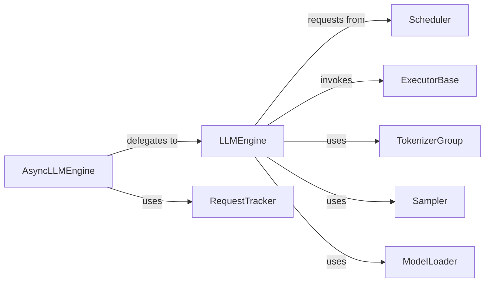

## Details

The `LLM Inference Orchestrator` subsystem is primarily defined by the `vllm.engine.async_llm_engine` and `vllm.engine.llm_engine` modules. These modules encapsulate the core logic for managing the lifecycle of an LLM inference request, from asynchronous handling to synchronous execution, scheduling, and model interaction.

### AsyncLLMEngine
The primary asynchronous public interface and orchestrator for incoming inference requests, managing their lifecycle from reception to completion.

**Related Classes/Methods**:

- <a href="https://github.com/vllm-project/vllm/blob/main/vllm/engine/async_llm_engine.py#L468-L1115" target="_blank" rel="noopener noreferrer">`vllm.engine.async_llm_engine.AsyncLLMEngine`:468-1115</a>

### LLMEngine
The core synchronous engine responsible for the actual model execution, KV cache management, and processing of outputs. It delegates to specialized components for scheduling, execution, and sampling.

**Related Classes/Methods**:

- <a href="https://github.com/vllm-project/vllm/blob/main/vllm/engine/llm_engine.py#L116-L1890" target="_blank" rel="noopener noreferrer">`vllm.engine.llm_engine.LLMEngine`:116-1890</a>

### RequestTracker
Manages the state and lifecycle of individual asynchronous inference requests, ensuring proper tracking and completion.

**Related Classes/Methods**:

- <a href="https://github.com/vllm-project/vllm/blob/main/vllm/engine/async_llm_engine.py#L124-L255" target="_blank" rel="noopener noreferrer">`vllm.engine.async_llm_engine.RequestTracker`:124-255</a>

### Scheduler [[Expand]](./Scheduler.md)
Determines the order and allocates resources for sequence groups, optimizing throughput and latency by managing the execution queue.

**Related Classes/Methods**:

- <a href="https://github.com/vllm-project/vllm/blob/main/vllm/engine/llm_engine.py" target="_blank" rel="noopener noreferrer">`vllm.engine.llm_engine.Scheduler`</a>

### ExecutorBase
An abstract component that defines and performs the model's forward pass, handling the actual computation on the underlying hardware.

**Related Classes/Methods**:

- <a href="https://github.com/vllm-project/vllm/blob/main/vllm/engine/llm_engine.py" target="_blank" rel="noopener noreferrer">`vllm.engine.llm_engine.ExecutorBase`</a>

### TokenizerGroup
Handles the tokenization of input prompts and the detokenization of generated outputs, bridging raw text with model-understandable tokens.

**Related Classes/Methods**:

- <a href="https://github.com/vllm-project/vllm/blob/main/vllm/engine/llm_engine.py" target="_blank" rel="noopener noreferrer">`vllm.engine.llm_engine.TokenizerGroup`</a>

### Sampler
Responsible for drawing tokens based on the processed logits from the model, implementing various sampling strategies (e.g., greedy, top-p, temperature).

**Related Classes/Methods**:

- <a href="https://github.com/vllm-project/vllm/blob/main/vllm/engine/llm_engine.py" target="_blank" rel="noopener noreferrer">`vllm.engine.llm_engine.Sampler`</a>

### ModelLoader
Loads and initializes the LLM model into memory, preparing it for inference by setting up weights and configurations.

**Related Classes/Methods**:

- <a href="https://github.com/vllm-project/vllm/blob/main/vllm/engine/llm_engine.py" target="_blank" rel="noopener noreferrer">`vllm.engine.llm_engine.ModelLoader`</a>

### [FAQ](https://github.com/CodeBoarding/GeneratedOnBoardings/tree/main?tab=readme-ov-file#faq)