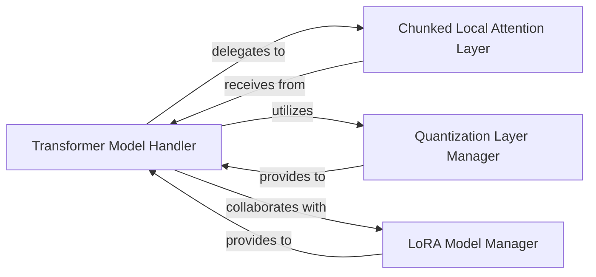

## Details

The `Model Executor` subsystem is responsible for the core execution of neural network models, focusing on specialized layers and optimizations.

### Transformer Model Handler
Orchestrates the entire forward pass of transformer models, including model initialization, loading of model parameters, and directing the data flow through the model's layers. It acts as the central control point for model execution.

**Related Classes/Methods**:

- <a href="https://github.com/vllm-project/vllm/blob/main/vllm/model_executor/models/transformers.py" target="_blank" rel="noopener noreferrer">`vllm/model_executor/models/transformers.py`</a>

### Chunked Local Attention Layer
Implements a highly optimized, chunked local attention mechanism designed to improve the efficiency and speed of attention computations, especially for long sequences.

**Related Classes/Methods**:

- <a href="https://github.com/vllm-project/vllm/blob/main/vllm/attention/layers/chunked_local_attention.py" target="_blank" rel="noopener noreferrer">`vllm/attention/layers/chunked_local_attention.py`</a>

### Quantization Layer Manager
Provides a framework for applying various quantization methods (e.g., AWQ, GPTQ, Marlin, FP8) to the model's weights and activations to reduce the model's memory footprint and accelerate inference.

**Related Classes/Methods**:

- <a href="https://github.com/vllm-project/vllm/blob/main/vllm/model_executor/layers/quantization/__init__.py" target="_blank" rel="noopener noreferrer">`vllm/model_executor/layers/quantization/__init__.py`</a>

### LoRA Model Manager
Manages the loading, activation, deactivation, pinning, adding, and removing of LoRA adapters, allowing for efficient switching between different fine-tuned versions of a base model.

**Related Classes/Methods**:

- <a href="https://github.com/vllm-project/vllm/blob/main/vllm/lora/models.py" target="_blank" rel="noopener noreferrer">`vllm/lora/models.py`</a>

### [FAQ](https://github.com/CodeBoarding/GeneratedOnBoardings/tree/main?tab=readme-ov-file#faq)