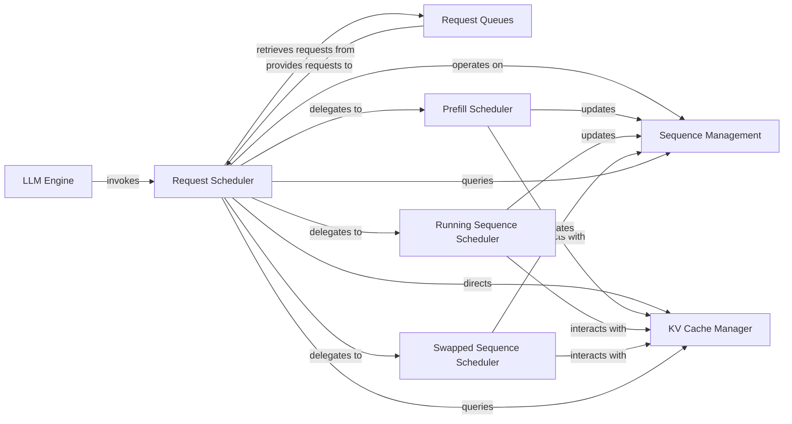

## Details

The vLLM inference engine's core subsystem is orchestrated by the **LLM Engine**, which drives the entire inference process. At its heart lies the **Request Scheduler**, a sophisticated component responsible for optimizing GPU utilization by dynamically batching and prioritizing inference requests. The `Request Scheduler` pulls new and waiting requests from **Request Queues** and manages their lifecycle using **Sequence Management** data structures. Crucially, it interacts with the **KV Cache Manager** (implemented by `vllm.core.block_manager`) for efficient allocation and deallocation of GPU memory for the Key-Value cache. The `Request Scheduler` further delegates specific tasks to specialized internal schedulers—**Prefill Scheduler**, **Running Sequence Scheduler**, and **Swapped Sequence Scheduler**—each handling different stages of sequence processing, all while coordinating with the `KV Cache Manager` and updating `Sequence Management`. This integrated approach ensures high throughput and low latency for large language model inference.

### Request Scheduler [[Expand]](./Request_Scheduler.md)
The central orchestrator responsible for optimizing GPU utilization by dynamically batching and prioritizing incoming requests. It makes critical decisions on sequence processing, memory swapping, and preemption to maximize throughput and minimize latency.

**Related Classes/Methods**:

- <a href="https://github.com/vllm-project/vllm/blob/main/vllm/core/scheduler.py" target="_blank" rel="noopener noreferrer">`vllm.core.scheduler`</a>

### Request Queues
Manages the incoming queue of new and waiting inference requests, providing a structured input stream to the Request Scheduler for processing.

**Related Classes/Methods**:

- <a href="https://github.com/vllm-project/vllm/blob/main/vllm/v1/core/sched/request_queue.py" target="_blank" rel="noopener noreferrer">`vllm.v1.core.sched.request_queue`</a>

### Sequence Management
Provides the fundamental data structures (SequenceGroup, Sequence) and methods necessary for representing and manipulating individual inference sequences throughout their lifecycle (prefill, running, swapped).

**Related Classes/Methods**:

- <a href="https://github.com/vllm-project/vllm/blob/main/vllm/sequence.py" target="_blank" rel="noopener noreferrer">`vllm.sequence`</a>

### KV Cache Manager [[Expand]](./KV_Cache_Manager.md)
Responsible for the efficient allocation, deallocation, and mapping of physical memory blocks for the Key-Value (KV) cache on the GPU, which is critical for storing attention keys and values during inference. The `vllm.core.block_manager` module serves as the concrete implementation for these functionalities.

**Related Classes/Methods**:

- <a href="https://github.com/vllm-project/vllm/blob/main/vllm/core/block_manager.py" target="_blank" rel="noopener noreferrer">`vllm.core.block_manager`</a>

### LLM Engine
The high-level engine that orchestrates the entire LLM inference process. It acts as the primary consumer of the Request Scheduler, invoking it to get scheduled batches and processing the outputs.

**Related Classes/Methods**:

- <a href="https://github.com/vllm-project/vllm/blob/main/vllm/engine/llm_engine.py" target="_blank" rel="noopener noreferrer">`vllm.engine.llm_engine`</a>

### Prefill Scheduler
A specialized component within the Request Scheduler responsible for handling new prompt requests. It allocates initial KV cache blocks and transitions these new sequences into a running state.

**Related Classes/Methods**:

- <a href="https://github.com/vllm-project/vllm/blob/main/vllm/core/scheduler.py" target="_blank" rel="noopener noreferrer">`vllm.core.scheduler:_schedule_prefills`</a>

### Running Sequence Scheduler
A specialized component within the Request Scheduler that manages the scheduling of sequences currently in active execution. It extends their processing and oversees token generation.

**Related Classes/Methods**:

- <a href="https://github.com/vllm-project/vllm/blob/main/vllm/core/scheduler.py" target="_blank" rel="noopener noreferrer">`vllm.core.scheduler:_schedule_running`</a>

### Swapped Sequence Scheduler
A specialized component within the Request Scheduler that handles sequences that have been temporarily moved to CPU memory (swapped out). Its role is to bring these sequences back into GPU memory for continued processing when resources become available.

**Related Classes/Methods**:

- <a href="https://github.com/vllm-project/vllm/blob/main/vllm/core/scheduler.py" target="_blank" rel="noopener noreferrer">`vllm.core.scheduler:_schedule_swapped`</a>

### [FAQ](https://github.com/CodeBoarding/GeneratedOnBoardings/tree/main?tab=readme-ov-file#faq)