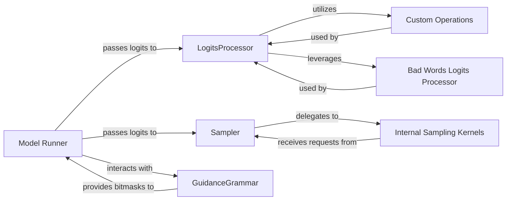

## Details

The subsystem under analysis is primarily concerned with the post-model output processing, specifically focusing on logit manipulation, sampling, and structured output generation within the `vllm` project. Its boundaries encompass components directly involved in transforming raw model logits into final generated tokens. The architecture ensures a modular, high-performance, and controllable process for generating diverse and constrained text outputs.

### Model Runner
Acts as the primary orchestrator within this subsystem. It receives raw logits from the model, applies grammar-based bitmasks, and passes the processed logits to the `LogitsProcessor` and subsequently to the `Sampler` for final token selection. This component is critical for pipelining the output generation steps.

**Related Classes/Methods**:

- <a href="https://github.com/vllm-project/vllm/blob/main/vllm/v1/worker/gpu_model_runner.py" target="_blank" rel="noopener noreferrer">`vllm.v1.worker.gpu_model_runner`</a>
- <a href="https://github.com/vllm-project/vllm/blob/main/vllm/v1/worker/tpu_model_runner.py" target="_blank" rel="noopener noreferrer">`vllm.v1.worker.tpu_model_runner`</a>

### LogitsProcessor
Applies various transformations and constraints to the raw logits, such as repetition penalties, bad word filtering, and logit biases. It prepares the logits for the subsequent sampling stage, ensuring adherence to user-defined generation parameters.

**Related Classes/Methods**:

- <a href="https://github.com/vllm-project/vllm/blob/main/vllm/model_executor/layers/logits_processor.py#L25-L126" target="_blank" rel="noopener noreferrer">`vllm.model_executor.layers.logits_processor.LogitsProcessor`:25-126</a>

### Sampler
The core component responsible for orchestrating the token sampling process. It applies various sampling methods (greedy, top-k, top-p) to the processed logits to determine the next token, and manages log probability calculation. It delegates the low-level sampling execution to optimized kernels.

**Related Classes/Methods**:

- <a href="https://github.com/vllm-project/vllm/blob/main/vllm/model_executor/layers/sampler.py#L163-L342" target="_blank" rel="noopener noreferrer">`vllm.model_executor.layers.sampler.Sampler`:163-342</a>

### GuidanceGrammar
Compiles and applies grammars (e.g., JSON schema, regex) to constrain output tokens. It generates a bitmask that is used by the `Model Runner` to mask logits, ensuring the generated text adheres to specified structural rules.

**Related Classes/Methods**:

- <a href="https://github.com/vllm-project/vllm/blob/main/vllm/v1/structured_output/backend_guidance.py#L99-L172" target="_blank" rel="noopener noreferrer">`vllm.v1.structured_output.backend_guidance.GuidanceGrammar`:99-172</a>

### Internal Sampling Kernels
Represents a collection of highly optimized, low-level kernels that perform probabilistic sampling based on chosen strategies (e.g., top-k, top-p). These operations are delegated by the `Sampler` for maximum performance and are typically implemented in performance-critical code (e.g., CUDA/C++ extensions or highly optimized Python functions) rather than a single, directly exposed Python module.

**Related Classes/Methods**:

### Custom Operations
Contains highly optimized custom operations, specifically for efficiently applying repetition penalties to modify logits. These operations are utilized by the `LogitsProcessor` to prevent repetitive text generation.

**Related Classes/Methods**:

- <a href="https://github.com/vllm-project/vllm/blob/main/vllm/_custom_ops.py" target="_blank" rel="noopener noreferrer">`vllm._custom_ops`</a>

### Bad Words Logits Processor
Provides functionalities for filtering undesirable words by masking out logits corresponding to specific tokens. This component is used by the `LogitsProcessor` to enforce content safety or specific output requirements.

**Related Classes/Methods**:

- <a href="https://github.com/vllm-project/vllm/blob/main/vllm/logits_process.py#L21-L45" target="_blank" rel="noopener noreferrer">`vllm.logits_process.get_bad_words_logits_processors`:21-45</a>

### [FAQ](https://github.com/CodeBoarding/GeneratedOnBoardings/tree/main?tab=readme-ov-file#faq)